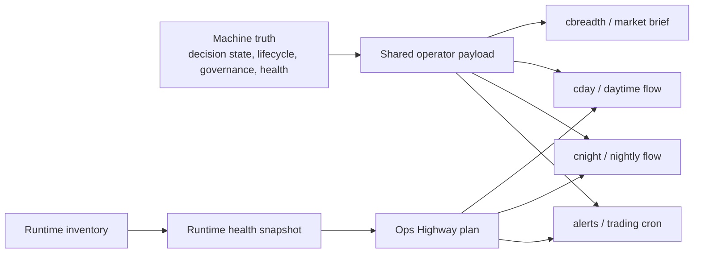

# Backtester

Python trading-analysis engine for:
- CANSLIM-style breakout review
- Dip Buyer scans
- market-regime-aware decision support
- nightly discovery and watchlist refresh
- paper-only research and calibration

This README is the operator manual.

Use the study guide when you want to understand the system conceptually:
- [Backtester Study Guide](./docs/source/guide/backtester-study-guide.md)
- [Roadmap](./docs/source/roadmap/roadmap.md)
- [Session Handoff](./docs/source/guide/session-handoff.md)
- [Schwab OAuth Reauth Runbook](./docs/source/runbook/schwab-oauth-reauth-runbook.md)
- [Streamer Failure Modes Runbook](./docs/source/runbook/streamer-failure-modes-runbook.md)
- [Scoring and Prediction Accuracy Reference](./docs/source/reference/scoring-prediction-accuracy-reference.md)

Other useful docs:
- [Polymarket + backtester flow](./docs/source/architecture/polymarket-backtester-flow.md)
- [Roadmap](./docs/source/roadmap/roadmap.md)
- [Decision review loop](./docs/source/architecture/decision-review-loop.md)
- [Trading cron base/enrichment/notify decoupling PRD](./docs/source/prd/prd-trading-cron-base-enrichment-notify-decoupling.md)
- [Polymarket market intelligence PRD](./docs/source/prd/prd-polymarket-market-intelligence.md)
- [Scoring and calibration notes](./docs/source/reference/scoring-calibration.md)
- [Scoring and prediction accuracy reference](./docs/source/reference/scoring-prediction-accuracy-reference.md)
- [Intraday breadth override PRD](./docs/source/prd/intraday-breadth-override-prd.md)
- [Uncertainty/confidence PRD](./docs/source/prd/uncertainty-confidence-prd.md)
- [Uncertainty runtime wiring](./docs/source/reference/uncertainty-confidence-runtime-wiring.md)
- [Market-data service reference](./docs/source/reference/market-data-service-reference.md)
- [Schwab OAuth reauth runbook](./docs/source/runbook/schwab-oauth-reauth-runbook.md)
- [Streamer failure modes runbook](./docs/source/runbook/streamer-failure-modes-runbook.md)

## Setup

Fresh clone:

```bash
# Install uv once if needed
curl -LsSf https://astral.sh/uv/install.sh | sh

cd /Users/hd/Developer/cortana-external/backtester
uv python install
uv venv .venv
source .venv/bin/activate
uv pip sync requirements.txt
```

Start the local TS market-data service in a separate terminal:

```bash
cd /Users/hd/Developer/cortana-external/apps/external-service
pnpm install
pnpm start
```

Schwab OAuth setup for local use:

```env
# /Users/hd/Developer/cortana-external/.env
SCHWAB_CLIENT_ID=...
SCHWAB_CLIENT_SECRET=...
SCHWAB_REDIRECT_URL=https://127.0.0.1:8182/auth/schwab/callback
EXTERNAL_SERVICE_TLS_PORT=8182
EXTERNAL_SERVICE_TLS_CERT_PATH=/Users/hd/Developer/cortana-external/.certs/127.0.0.1.pem
EXTERNAL_SERVICE_TLS_KEY_PATH=/Users/hd/Developer/cortana-external/.certs/127.0.0.1-key.pem
```

Register this callback in the Schwab developer portal:

```text
https://127.0.0.1:8182/auth/schwab/callback
```

Then use the local auth routes:

```bash
# Start the HTTP API on 3033 and the HTTPS callback listener on 8182
cd /Users/hd/Developer/cortana-external/apps/external-service
pnpm start

# Get the Schwab login URL
curl http://127.0.0.1:3033/auth/schwab/url

# Check whether the token was saved successfully
curl http://127.0.0.1:3033/auth/schwab/status
```

If Schwab auth breaks or needs to be rotated later, use:
- [Schwab OAuth Reauth Runbook](./docs/source/runbook/schwab-oauth-reauth-runbook.md)

Notes:
- Schwab requires an `https://` callback URL
- `127.0.0.1` works better than `localhost` for Schwab callback registration
- a self-signed local cert is fine for this flow; your browser may warn before redirecting to the local callback
- the service persists the exchanged Schwab refresh token at `SCHWAB_TOKEN_PATH`
- this repo now has a generated local dev cert/key at:
  - `/Users/hd/Developer/cortana-external/.certs/127.0.0.1.pem`
  - `/Users/hd/Developer/cortana-external/.certs/127.0.0.1-key.pem`
  - and `.certs/` is gitignored

Optional Polymarket context:

```bash
cd /Users/hd/Developer/cortana-external
pnpm install
./tools/market-intel/run_market_intel.sh
```

Important notes:
- Alpaca keys are no longer required for normal backtester runs
- the Python engine now reads external market data through the local TS service
- direct crypto `quote`, `snapshot`, `metadata`, and `fundamentals` now come from CoinMarketCap through the TS market-data service
- configure CoinMarketCap with:
  - `COINMARKETCAP_API_KEY`
  - `COINMARKETCAP_API_BASE_URL` (defaults to `https://pro-api.coinmarketcap.com`)
- the current CoinMarketCap API plan does not support historical crypto quotes, so the TS service supports a daily direct-crypto refresh flow for `BTC` / `ETH` style symbols
- that refresh appends one daily row per symbol into `.cache/market_data/crypto-daily-cache.json`
- direct crypto `history` uses that artifact first and only falls back to the unsupported CoinMarketCap historical endpoint if no cached rows exist yet
- direct crypto `quick-check` therefore improves over time as daily rows accumulate, but it will still be thin at the beginning of the series
- default runtime order is `Schwab -> Python cache`
- quote freshness can use `LEVELONE_EQUITIES` and snapshot freshness can use `CHART_EQUITY` inside the Schwab streamer session when credentials and user preferences are available
- local Schwab OAuth is now exposed through:
  - `GET /auth/schwab/url`
  - `GET /auth/schwab/callback`
  - `GET /auth/schwab/status`
- the Schwab streamer is now supervised inside TS with heartbeat tracking, reconnect backoff, delta subscription updates (`SUBS` + `ADD` + `UNSUBS`), and automatic resubscribe for active symbols
- multi-instance deployment can now use automatic or designated streamer leadership:
  - `SCHWAB_STREAMER_ROLE=auto` uses Postgres advisory locks to choose one leader
  - `SCHWAB_STREAMER_ROLE=leader` forces this instance to own the stream
  - `SCHWAB_STREAMER_ROLE=follower` disables the local Schwab socket and reads shared leader state
  - shared quote/chart state defaults to `postgres`
  - `SCHWAB_STREAMER_SHARED_STATE_BACKEND=file` is dev-only
  - file path: `SCHWAB_STREAMER_SHARED_STATE_PATH`
- FRED, CBOE, and the base-universe artifact are also owned by the TS service
- the base-universe artifact now supports a source ladder in TS: `remote_json -> local_json`
- the default local base-universe source is now the bundled full-S&P artifact at `config/universe/sp500-constituents.json` (`502` symbols in the current snapshot)
- the bundled `local_json` S&P artifact is the default base-universe source
- if the service was already running on the older seed-backed cache, restart `apps/external-service` or call `POST /market-data/universe/refresh` after updating so the new base-universe artifact is rebuilt
- Alpaca is no longer part of the default runtime chain; use it only for explicit compare/diagnostic checks
- Polymarket integration is read-only
- if you skip Polymarket refresh, the Python backtester still runs
- the local `daytime_flow.sh` and `nighttime_flow.sh` wrappers now run a market-data preflight first
- by default, those wrappers fail fast if the TS service is unreachable or Schwab is not configured yet
- override with:
  - `REQUIRE_MARKET_DATA_SERVICE=0` to skip the preflight entirely
  - `REQUIRE_SCHWAB_CONFIGURED=0` to allow cache-only / degraded local runs on purpose

## Start Here

Most useful first commands:

```bash
cd /Users/hd/Developer/cortana-external/backtester

# Market regime only
uv run python advisor.py --market

# Full analysis for one stock
uv run python advisor.py --symbol NVDA

# Fast verdict for one stock / proxy / coin
uv run python advisor.py --quick-check BTC

# Compact CANSLIM and Dip Buyer summaries
uv run python canslim_alert.py --limit 8 --min-score 6
uv run python dipbuyer_alert.py --limit 8 --min-score 6

# Broader overnight discovery
uv run python nightly_discovery.py --limit 20

# Compact snapshot for the main Cortana stock-market cron
uv run python market_brief_snapshot.py --operator
uv run python market_brief_snapshot.py --pretty

# Runtime and ops-highway surfaces
uv run python runtime_inventory_snapshot.py --pretty
uv run python runtime_health_snapshot.py --pretty
uv run python ops_highway_snapshot.py --pretty
```

`market_brief_snapshot.py` is the lightweight export used by the main `cortana` repo's daily stock-market brief.
It is deliberately smaller than `daytime_flow.sh`:
- market regime + position sizing
- Schwab-backed tape read for `SPY`, `QQQ`, `IWM`, `DIA`, `GLD`, `TLT`
- intraday breadth state:
  - `inactive`
  - `selective-buy`
  - `unavailable`
- Polymarket macro posture
- focus names from leader baskets + Polymarket watch tickers

The new intraday breadth block is there to catch broad rally days inside a still-defensive daily regime.
When it flips to `selective-buy`, Dip Buyer can keep a very small number of top-ranked `BUY` setups instead of downgrading every one of them to `WATCH`.
That override is intentionally bounded:
- Dip Buyer only
- regular session only
- broad participation required
- tight cap on how many correction-mode `BUY` names can survive

Outside regular market hours, the brief now prefers the last completed-session regime snapshot instead of forcing a live refresh.
If live tape is unavailable during premarket / after-hours, it falls back to previous-session cached tape where possible instead of emitting a hard 503-style tape failure.

It does not include:
- portfolio / holdings
- full CANSLIM or Dip Buyer scans
- Telegram delivery logic

Typed consumer-field guidance lives in [consumer-contracts.md](docs/source/reference/consumer-contracts.md).

## Workflow Wrappers

From [backtester](.):

```bash
# Daytime operator flow: context refresh, regime, alerts, quick check
./scripts/daytime_flow.sh

# Nighttime discovery flow: broader scan and cache refresh
./scripts/nighttime_flow.sh

# Historical strategy backtest flow
./scripts/backtest_flow.sh

# Paper-only experimental report + optional snapshot persist
./scripts/experimental_report_flow.sh

# Settle old research snapshots and rebuild calibration artifacts
./scripts/experimental_maintenance_flow.sh
```

Common overrides:

```bash
# Backtest NVIDIA over 3 years with the default momentum strategy
SYMBOL=NVDA YEARS=3 ./scripts/backtest_flow.sh

# Compare the built-in momentum variants on AAPL over 2 years
SYMBOL=AAPL YEARS=2 COMPARE=1 ./scripts/backtest_flow.sh

# Skip the Polymarket/context refresh during daytime flow
RUN_MARKET_INTEL=0 ./scripts/daytime_flow.sh

# Skip the X/Twitter dynamic watchlist refresh during daytime flow
RUN_DYNAMIC_WATCHLIST_REFRESH=0 ./scripts/daytime_flow.sh

# Skip the market-data ops summary in the local wrappers
RUN_MARKET_DATA_OPS=0 ./scripts/daytime_flow.sh

# Change the quick-check symbol
QUICK_CHECK_SYMBOL=NVDA ./scripts/daytime_flow.sh

# Refresh direct crypto daily cache before the run
RUN_CRYPTO_DAILY_REFRESH=1 CRYPTO_REFRESH_SYMBOLS=BTC,ETH ./scripts/daytime_flow.sh

# Include a full stock deep dive in daytime flow
RUN_DEEP_DIVE=1 DEEP_DIVE_SYMBOL=AAPL ./scripts/daytime_flow.sh

# Nighttime report only, no live prefilter refresh
SKIP_LIVE_PREFILTER_REFRESH=1 ./scripts/nighttime_flow.sh

# Broader nightly scan
NIGHTLY_LIMIT=30 ./scripts/nighttime_flow.sh

# Refresh direct crypto daily cache during the overnight pass
RUN_CRYPTO_DAILY_REFRESH=1 CRYPTO_REFRESH_SYMBOLS=BTC,ETH ./scripts/nighttime_flow.sh

# Point the local wrappers at a non-default TS service URL
MARKET_DATA_SERVICE_URL=http://localhost:3033 ./scripts/daytime_flow.sh

# Intentionally allow degraded local wrapper runs without Schwab configured
REQUIRE_SCHWAB_CONFIGURED=0 ./scripts/daytime_flow.sh

# Pick which leader-bucket window feeds soft priority
TRADING_LEADER_BASKET_PRIORITY_WINDOW=weekly ./scripts/daytime_flow.sh
```

## Streaming: How To Use It

For your normal operator workflow:

- keep Schwab streaming enabled by default
- run the wrappers normally
- do not treat `connected no` in the ops block as a failure

Why:

- `daytime_flow.sh` and `nighttime_flow.sh` are mainly analysis workflows
- they lean heavily on:
  - history
  - regime
  - risk
  - screening
  - Polymarket context
- those do not require a constantly active websocket session

When streaming helps most:

- freshest intraday quotes
- freshest intraday snapshots
- a small intraday watchlist where you care about the latest tape

When streaming matters less:

- nightly discovery
- regime calculations
- broad daytime scans
- history-heavy analysis
- most of the normal wrapper output

Recommended operating model:

- default
  - keep streaming on
- debug
  - turn streaming off only when you are troubleshooting streamer behavior
- optional live-watch helper
  - separate from the wrappers
  - useful only if you want a tighter intraday read on SPY / QQQ / a short watchlist

Workflow-first aliases:

```bash
alias cop='cd /Users/hd/Developer/cortana-external/backtester && ./scripts/operator_workflow.sh'
alias cop_pre='cop premarket'
alias cop_open='cop open'
alias cop_mid='cop midday'
alias cop_close='cop close'
alias cop_night='cop night'
alias cop_health='cop health'

alias cday='cd /Users/hd/Developer/cortana-external/backtester && ./scripts/daytime_flow.sh'
alias cnight='cd /Users/hd/Developer/cortana-external/backtester && ./scripts/nighttime_flow.sh'
alias cday_nostream='cd /Users/hd/Developer/cortana-external/backtester && SCHWAB_STREAMER_ENABLED=0 ./scripts/daytime_flow.sh'
alias clive='cd /Users/hd/Developer/cortana-external/backtester && ./scripts/live_watch.sh'
alias clive4='cd /Users/hd/Developer/cortana-external/backtester && WATCH_SYMBOLS=SPY,QQQ,DIA,NVDA FOCUS_SYMBOL=SPY ./scripts/live_watch.sh'
alias cxauth='cd /Users/hd/Developer/cortana-external && ./tools/stock-discovery/sync_bird_auth.sh'
alias crefresh_watchlists='cd /Users/hd/Developer/cortana-external && ./tools/market-intel/run_market_intel.sh && ./tools/stock-discovery/trend_sweep.sh'
alias cwatch='cd /Users/hd/Developer/cortana-external/backtester && ./scripts/watchlist_watch.sh'
alias cwatch20='cd /Users/hd/Developer/cortana-external/backtester && WATCHLIST_LIMIT=20 ./scripts/watchlist_watch.sh'
```

How to think about them:

- `cop`
  - main operator entrypoint
  - use it for:
    - `cop premarket`
    - `cop open`
    - `cop midday`
    - `cop close`
    - `cop night`
    - `cop health`
- `cday`
  - direct daytime flow
  - keep this for direct access or debugging
- `cnight`
  - direct nighttime discovery run
- `cday_nostream`
  - debug-only comparison mode
- `clive`
  - quick live quote/snapshot glance for the default watch list
- `clive4`
  - quick live quote/snapshot glance for `SPY,QQQ,DIA,NVDA`
- `cxauth`
  - validate or persist private X/Twitter auth for the stock-discovery sweep
- `crefresh_watchlists`
  - force-refresh both watchlist sources before checking them live
- `cwatch`
  - quick live watchlist pulse using the latest Polymarket + dynamic watchlists
- `cwatch20`
  - same as `cwatch`, but shows a larger top-20 slice

If you want the simplest daily habit:

- `cop premarket`
- `cop open`
- `cop midday`
- `cop close`
- `cop night`
- `cop health`

X/Twitter auth note:

- `trend_sweep.sh` now preserves the existing dynamic watchlist when `bird` auth is unavailable
- it no longer wipes `dynamic_watchlist.json` down to `0` tickers on auth failure
- by default the X/Twitter sweep now targets the OpenClaw browser profile rather than your personal Chrome profile
- `cxauth` now uses the OpenClaw browser profile first, not your personal browser session
- if OpenClaw is closed, the sync script starts it automatically before reading cookies
- if the saved private auth file is stale, `trend_sweep.sh` now re-runs the sync automatically and retries once before falling back
- successful syncs are stored privately at:
  - `~/.config/cortana/x-twitter-bird.env`
- future `cday` / `crefresh_watchlists` runs source that file automatically
- failed or interrupted syncs now clean up their lock state automatically, so one bad run should not wedge later refreshes

What the optional live-watch idea means:

- this is not a replacement for `daytime_flow.sh`
- it would just be a tiny helper that asks the TS service for a few fresh quote/snapshot calls like:
  - `/market-data/quote/SPY`
  - `/market-data/snapshot/SPY`
  - `/market-data/quote/batch`
- that kind of helper is useful when you want a faster intraday feel for a few names
- it is not necessary for the core daytime/nighttime workflow
- this repo now includes that helper as:
  - `./scripts/live_watch.sh`

What the watchlist pulse helper means:

- this is the missing middle ground between `clive` and `cday`
- it does not rescan the market
- it reads the latest watchlist artifacts, grabs fresh quotes for those names, and shows:
  - what is new since the last check
  - what dropped off
  - how the current watchlist names are moving right now
- use it when you want:
  - "what changed in my watchlist since the last check?"
  - "are my current names actually moving?"
- the repo now includes that helper as:
  - `./scripts/watchlist_watch.sh`

If you are SSHed into the Mac mini:

- put the aliases in the remote `~/.zshrc` on the Mac mini
- open a new SSH session or run `source ~/.zshrc`
- then use:
  - `cday`
  - `cnight`
  - `cday_nostream`
  - `clive`
  - `clive4`
  - `cwatch`
  - `cwatch20`

## When To Run Each Script

Use this as the default operator cadence:

- `./scripts/daytime_flow.sh`
  - run during market hours when you want the current regime, live bucket context, market-data ops summary, CANSLIM, Dip Buyer, and a quick-check in one local view
  - best for `pre-market`, `morning`, `midday`, or `late afternoon` spot checks
  - optional: pass `RUN_CRYPTO_DAILY_REFRESH=1` to refresh the direct crypto daily cache once before the rest of the run
- `./scripts/nighttime_flow.sh`
  - run after market close or overnight
  - use it to refresh the next day’s inputs, rebuild leader buckets, print the current market-data ops state, settle logged prediction snapshots, and persist nightly research artifacts
  - optional: pass `RUN_CRYPTO_DAILY_REFRESH=1` to seed/update the direct crypto daily cache overnight
- `./scripts/backtest_flow.sh`
  - run when you want to test a strategy on past data instead of reading the live operator flow
  - best for idea validation, not live decisions
- `./scripts/experimental_report_flow.sh`
  - run only when you want extra paper-only research ideas for a custom basket
  - this is optional and not required for the core daily workflow
- `./scripts/experimental_maintenance_flow.sh`
  - run occasionally, usually overnight or before market open, when you want to settle old paper ideas and refresh calibration research
  - not required every time you use the daytime flow

Simple routine:

```bash
# After market close or overnight
./scripts/nighttime_flow.sh

# During the next trading day
./scripts/daytime_flow.sh
```

## Daily Workflow

Typical daytime loop:

```bash
cd /Users/hd/Developer/cortana-external/backtester
./scripts/daytime_flow.sh
```

What it does:
- refreshes market context by default
- prints the current market regime
- shows the latest leader buckets if available
- shows leader buckets as `% move (appearances)`:
  - `% move` = move over that bucket window
  - `(x)` = how many times that name has appeared in that bucket
- runs CANSLIM alert
- runs Dip Buyer alert
- runs a quick-check
- saves raw and formatted local artifacts under:
  - `var/local-workflows/`

New alert wording:
- `Alert posture`
  - the compact urgency label for the alert itself
  - `review only`
    - this is a watchlist/status update, not a buy-now alert
  - `stand aside`
    - the market posture is defensive and the alert is not asking for action now
- `Calibration note`
  - tells you whether confidence is backed by settled history yet
  - `uncalibrated`
    - the model can still rank names, but the confidence number is not proven by closed outcomes yet

Service note:
- the live engine expects the TS service at `http://localhost:3033` unless you override `MARKET_DATA_SERVICE_URL`
- if the service is unavailable, Python falls back to local cache where possible and otherwise uses conservative degraded behavior
- the local daytime wrapper now checks `/market-data/ready` and `/market-data/ops` before it does expensive work
- if the service is down or Schwab is not configured, the wrapper exits early with an operator-facing preflight message instead of grinding through a slow degraded run

Best use:
- during market hours
- when you want a compact local operator view

## Nightly Workflow

Typical nightly loop:

```bash
cd /Users/hd/Developer/cortana-external/backtester
./scripts/nighttime_flow.sh
```

What it does:
- runs broader nightly discovery
- refreshes the live-universe prefilter cache unless skipped
- refreshes liquidity overlay cache
- persists a fresh experimental-alpha snapshot
- refreshes the buy-decision calibration artifact
- rebuilds leader-basket artifacts

Service note:
- nightly discovery also depends on the TS market-data service for history, fundamentals, risk data, and base-universe refresh
- the local nightly wrapper now does the same market-data preflight as daytime
- this avoids long degraded discovery runs when the TS service is down or Schwab has not been configured yet

Best use:
- after market close or overnight
- before the next day’s live scan

## Core Surfaces

Think of the system as three layers:

- `machine truth`
  - the structured artifacts that say what the system believes
- `operator surfaces`
  - the commands you read: `cbreadth`, `cday`, `cnight`, alerts, lifecycle review
- `ops highway`
  - the health, retention, backup, and recovery layer that keeps the machine safe to run

Simple relationship:



What to read first:

- `cbreadth`
  - smallest answer
  - use when you want: "what is the market posture right now?"
- `cday`
  - daytime operator surface
  - use when you want: "what should I pay attention to today?"
- `cnight`
  - overnight operator surface
  - use when you want: "what changed, what was measured, and what should I review tomorrow?"
- `runtime_health_snapshot.py --pretty`
  - machine health truth
  - use when you want: "is the live lane actually healthy?"
- `ops_highway_snapshot.py --pretty`
  - operating plan
  - use when you want: "what should be retained, backed up, watched, or recovered?"

Examples:

```bash
# Smallest readable market answer
cd /Users/hd/Developer/cortana-external/backtester
uv run python market_brief_snapshot.py --operator

# Raw machine payload for the same brief
uv run python market_brief_snapshot.py --pretty

# What is running, what matters, what should be inspected
uv run python runtime_inventory_snapshot.py --pretty

# Is the Mac mini healthy enough for live work right now?
uv run python runtime_health_snapshot.py --pretty

# Retention, backup, incident, and change-management plan
uv run python ops_highway_snapshot.py --pretty
```

How to read them:

- if `cbreadth` says `NO_BUY | CORRECTION`, that is your market posture
- if `runtime_health_snapshot.py` is degraded, trust the warning before trusting the scan
- if `ops_highway_snapshot.py` says a path is critical, that means recovery depends on it

The important rule:
- prose can be short
- machine truth cannot drift
- every operator surface should tell the same story at a different zoom level

## Market Data Boundary

The Python layer is now the engine only. External IO lives behind the TS service in:
- `/Users/hd/Developer/cortana-external/apps/external-service`

Provider order:
- `Schwab`
- `Schwab streamer` for fresher `LEVELONE_EQUITIES` quote state and `CHART_EQUITY` intraday candle state when available
- Python local cache as the last fallback

Operational notes:
- streamer health and reconnect state are exposed through the TS service health payload
- that health payload now includes message rate, stale symbol count, reconnect failure streak, token refresh state, and last successful Schwab refresh timestamps
- the streamer keeps a bounded subscription registry for active quote/chart symbols and resubscribes them after reconnects
- streamer mutation commands are now serialized per service and wait for Schwab acks, which reduces `FAILED_COMMAND_SUBS` / `ADD` / `UNSUBS` / `VIEW` races
- larger subscription mutations are now chunked and the registry prunes older symbols back toward the configured soft cap before budget pressure turns into a hard failure
- the streamer also runs periodic `VIEW` reconciliation so the Schwab field set stays aligned with the intended quote/chart subscriptions
- documented Schwab failure codes like `LOGIN_DENIED`, `STREAM_CONN_NOT_FOUND`, `STOP_STREAMING`, `CLOSE_CONNECTION`, and `REACHED_SYMBOL_LIMIT` are now handled explicitly instead of only surfacing as generic reconnect noise
- the ops surface now exposes runbook-grade operator state and symbol-budget accounting so max-connection or subscription-limit issues are visible before they become silent drift
- Postgres-backed shared streamer state now propagates with `LISTEN/NOTIFY` so follower instances react to quote/chart updates faster than file polling
- file-backed follower mode now rechecks shared-state file mtimes instead of pinning the first cached snapshot forever
- `/market-data/ops` and `/market-data/universe/audit` provide a compact operator surface for streamer role, lock ownership, health, source/fallback mix, and universe artifact refresh history
- `/market-data/ready` now gives a compact readiness answer for scans or wrappers that want to check service state before doing a full run
- token refresh is single-flight inside TS so concurrent Schwab requests do not stampede the refresh endpoint
- base-universe refresh is no longer just a Python static-seed copy; TS can prefer a configured remote or local JSON universe source and only fall back to the Python seed when needed
- universe ownership is now more explicit in ops: the service exposes the artifact path, audit path, source ladder, and the expectation that the bundled S&P artifact is the default base-universe source
- recommended production shape is now:
  - `SCHWAB_STREAMER_ROLE=auto`
  - `SCHWAB_STREAMER_SHARED_STATE_BACKEND=postgres`
  - `SCHWAB_STREAMER_SYMBOL_SOFT_CAP=<bounded value>` so the ops surface can warn before Schwab returns `REACHED_SYMBOL_LIMIT`
  - `SCHWAB_STREAMER_EQUITY_FIELDS=<explicit field set>` if you want to widen or narrow the default Level 1 equity stream payload

Backtester-facing service endpoints:
- `GET /market-data/ready`
- `GET /market-data/ops`
- `GET /market-data/history/:symbol`
- `GET /market-data/history/batch`
- `GET /market-data/quote/:symbol`
- `GET /market-data/quote/batch`
- `GET /market-data/snapshot/:symbol`
- `GET /market-data/fundamentals/:symbol`
- `GET /market-data/metadata/:symbol`
- `GET /market-data/universe/base`
- `POST /market-data/universe/refresh`
- `GET /market-data/risk/history`
- `GET /market-data/risk/snapshot`

See [Market-data service reference](./docs/source/reference/market-data-service-reference.md) for compact endpoint notes, readiness semantics, and streamer recovery basics.

History route notes:
- `GET /market-data/history/:symbol` now honors `interval=1d|1wk|1mo` instead of silently collapsing everything to daily bars
- for diagnostics, you can also force the primary history source with `provider=service|schwab|alpaca`
- this is separate from `compare_with=<provider>`:
  - `provider=` changes the primary source for that history response
  - `compare_with=` leaves the primary source alone and adds comparison metadata
- `GET /market-data/history/batch?symbols=AAPL,MSFT,...` applies one shared `period` / `interval` / `provider` request shape across many symbols and returns per-symbol items in one response

Quote route notes:
- `GET /market-data/quote/batch?symbols=AAPL,MSFT,...` returns a per-symbol quote list in one response, which is useful for larger scan surfaces or external tooling
- the default Schwab `LEVELONE_EQUITIES` subscription now requests a richer field set, including total volume, 52-week high/low, security status, and net percent change, so fresher quote responses can carry more of the context that used to require extra polling

Optional compare mode:
- use `compare_with=alpaca` or another supported provider on the TS endpoints when you want a diagnostic comparison without changing the default runtime chain

Use these depending on what question you are asking:

- `uv run python advisor.py --market`
  - What is the market environment right now?

- `uv run python advisor.py --symbol NVDA`
  - Give me the full explanation for one stock.

- `uv run python advisor.py --quick-check BTC`
  - Is this single stock / proxy / coin worth attention right now?

- `uv run python canslim_alert.py --limit 8 --min-score 6`
  - Give me the compact CANSLIM-style summary.

- `uv run python dipbuyer_alert.py --limit 8 --min-score 6`
  - Give me the compact Dip Buyer summary.

- `uv run python nightly_discovery.py --limit 20`
  - Show me broader overnight leaders and refresh tomorrow’s inputs.

- `uv run python main.py --symbol NVDA --years 2 --compare`
  - Run the legacy backtest entrypoint.

- `./scripts/backtest_flow.sh`
  - Run the beginner-friendly historical backtest wrapper.

## Historical Backtesting

Use this when you want to test a strategy on past data instead of reading the live advisor flows.

Wrapper:

```bash
cd /Users/hd/Developer/cortana-external/backtester
./scripts/backtest_flow.sh
```

Examples:

```bash
# Backtest one symbol with the default momentum strategy
SYMBOL=NVDA YEARS=2 ./scripts/backtest_flow.sh

# Try a different built-in strategy
SYMBOL=MSFT YEARS=5 STRATEGY=aggressive ./scripts/backtest_flow.sh

# Compare all momentum variants instead of picking one strategy
SYMBOL=AAPL YEARS=3 COMPARE=1 ./scripts/backtest_flow.sh
```

Available env vars:
- `SYMBOL`
- `YEARS`
- `STRATEGY`
  - `momentum`
  - `aggressive`
  - `conservative`
- `CASH`
- `BENCHMARK`
- `COMPARE`

Important distinction:
- `backtest_flow.sh` = historical backtest on past price data
- `daytime_flow.sh` = live/operator analysis workflow
- `nighttime_flow.sh` = broader overnight discovery / cache refresh workflow

## Universe and Selection

Universe tiers:
- `quick`
  - growth watchlist only
- `standard`
  - curated broad universe plus dynamic additions
- `nightly_discovery`
  - broader nightly universe using the TS-owned S&P 500 base-universe artifact, then layering growth and dynamic watchlist additions
  - the nightly report now prints `Universe breakdown: base | growth | dynamic-only | total`
  - `growth` = the always-include leadership / growth overlay
  - `dynamic-only` = Polymarket / X-Twitter additions not already in the base or growth lists
  - the final nightly universe is deduped before scanning, so overlap between those layers is not scanned twice

Live 120-name basket:
- explicit priority symbols are still pinned first
- nightly leader buckets now contribute bounded soft-priority
- static growth watchlist priority is bounded instead of dominating the basket
- remaining slots are filled by the deterministic prefilter ranking model
- if prefilter artifacts are stale or missing, the system falls back to deterministic ordering

Leader-bucket artifacts:
- latest snapshot:
  - [.cache/leader_baskets/latest-snapshot.json](./.cache/leader_baskets/latest-snapshot.json)
- rolling history:
  - [.cache/leader_baskets/history](./.cache/leader_baskets/history)
- latest buckets:
  - [.cache/leader_baskets/leader-baskets-latest.json](./.cache/leader_baskets/leader-baskets-latest.json)
- operator-friendly symbol files:
  - `daily.txt`
  - `weekly.txt`
  - `monthly.txt`
  - `priority.txt`

Leader-bucket display meaning:
- `OXY +3.2% (1x)`
  - `+3.2%` = move over that bucket window
  - `(1x)` = that symbol appeared once in that bucket window
- `daily.txt`, `weekly.txt`, and `monthly.txt` use the same `% move (appearances)` format
- `priority.txt` stays symbol-only because it is the bounded live-priority set, not a performance summary

Important boundary:
- leader buckets are operational watchlist-selection input
- they are not direct trade authority
- final `BUY / WATCH / NO_BUY` authority still comes from the Python regime + technical engine

## Polymarket Integration

Run before daytime stock alerts when you want fresh macro context:

```bash
cd /Users/hd/Developer/cortana-external
./tools/market-intel/run_market_intel.sh
```

What it does:
1. refreshes the `SPY` regime snapshot
2. rebuilds Polymarket artifacts
3. verifies the Python bridge can read them

Files written:
- [../var/market-intel/polymarket/latest-compact.txt](../var/market-intel/polymarket/latest-compact.txt)
- [../var/market-intel/polymarket/latest-report.json](../var/market-intel/polymarket/latest-report.json)
- [data/polymarket_watchlist.json](./data/polymarket_watchlist.json)

Runtime behavior:
- Polymarket is extra context, not the main decision authority
- stale Polymarket artifacts are rejected by freshness checks
- direct crypto remains contextual and does not automatically enter the stock screener
- the current market-intel lane is now Polymarket US only
- credentialed US account validation uses `POLYMARKET_KEY_ID` / `POLYMARKET_SECRET_KEY`
- the legacy macro registry is only partially compatible with the current US public feed, so artifact quality will remain limited until that registry is rebuilt

## Research and Calibration

Paper-only research commands:

```bash
cd /Users/hd/Developer/cortana-external/backtester

uv run python experimental_alpha.py --symbols NVDA,BTC,COIN
uv run python experimental_alpha.py --persist
uv run python experimental_alpha.py --settle
uv run python buy_decision_calibration.py
```

What these are for:
- `experimental_alpha.py`
  - paper-only research ideas
- `--persist`
  - save today’s research snapshot
- `--settle`
  - measure what happened later
- `buy_decision_calibration.py`
  - summarize whether recent research buckets have been useful

Accuracy loop:
- alert strategies also log prediction snapshots automatically
- `prediction_accuracy_report.py`
  - settles those snapshots against later price history
  - shows how much data has matured at `1d`, `5d`, and `20d`
  - reports results by:
    - `strategy + action`
    - `strategy + market regime + action`
    - `strategy + confidence bucket + action`

How to read the accuracy output:
- `Snapshots settled`
  - how many saved prediction snapshots have been processed into the settled store
- `Records logged`
  - how many individual symbol-level calls are available across those snapshots
- `Settlement coverage`
  - `matured`
    - enough time has passed and the system found a later bar for that horizon
  - `pending`
    - the horizon has not elapsed yet
  - `incomplete`
    - the horizon elapsed, but the system could not build a complete settlement sample
- `By strategy/action`
  - the top-level view of how each strategy decision aged
- `By regime`
  - whether the same strategy behaves differently in `confirmed_uptrend`, `under_pressure`, or `correction`
- `By confidence bucket`
  - whether higher-confidence calls are actually performing better than lower-confidence calls

Action-aware success labels:
- `buy_success_rate`
  - percent of settled `BUY` calls that were positive over that horizon
- `watch_success_rate`
  - percent of settled `WATCH` calls that ended up being directionally correct over that horizon
- `avoidance_rate`
  - percent of settled `NO_BUY` calls where avoiding the stock was the right choice because the forward return was flat/down

Risk columns:
- `avg drawdown`
  - average worst move against the signal before the horizon settled
- `avg runup`
  - average best move in favor of the signal before the horizon settled

Important boundary:
- research artifacts can inform future tuning
- they do not directly own the live watchlist or live trade authority

## Artifacts and Cache

Important operational files:

- market regime snapshot:
  - [.cache/market_regime_snapshot_SPY.json](./.cache/market_regime_snapshot_SPY.json)
- live prefilter cache:
  - [data/cache/live_universe_prefilter.json](./data/cache/live_universe_prefilter.json)
- liquidity overlay cache:
  - [data/cache/liquidity_overlay.json](./data/cache/liquidity_overlay.json)
- buy-decision calibration:
  - [.cache/experimental_alpha/calibration/buy-decision-calibration-latest.json](./.cache/experimental_alpha/calibration/buy-decision-calibration-latest.json)

How to think about `.cache`:
- code = the brain
- `.cache` = working memory / prepared inputs
- `var/` = historical diary of actual runs

If `.cache` is missing:
- the repo is not ruined
- many artifacts can be rebuilt by rerunning the normal commands
- but the live system may become slower, less informed, or forced into fallback behavior until refreshed

## Troubleshooting

- Polymarket looks stale
  - rerun `./tools/market-intel/run_market_intel.sh`

- leader buckets are missing
  - run `./scripts/nighttime_flow.sh`

- local daytime flow says leader basket artifact is missing
  - run a nightly flow first so the bucket files exist

- prefilter cache is stale or missing
  - run `uv run python nightly_discovery.py --limit 20`
  - or `./scripts/nighttime_flow.sh`

- calibration says `no_settled_records`
  - the pipeline is usually fine
  - it means the research history exists but there are no settled samples yet
  - if daytime alerts say `Calibration note: uncalibrated`, read that as:
    - ranking is still live
    - confidence is still model-estimated rather than validated by enough closed outcomes

- prediction accuracy says `No settled prediction samples yet.`
  - snapshot logging is working
  - but the settled accuracy buckets still do not have enough matured records to report something useful yet
  - give it time to accumulate `1d`, then `5d`, then `20d` outcomes

- stale symbol noise during nightly runs
  - use the current `main`; the nightly path now suppresses common provider noise and removes obvious stale bundled symbols

## Development

```bash
cd /Users/hd/Developer/cortana-external/backtester

# Setup or refresh env
uv venv .venv
source .venv/bin/activate
uv pip sync requirements.txt

# Example targeted test run
uv run pytest tests/test_nightly_discovery.py tests/test_universe_selection.py
```
