# Backtester Study Guide

This is a plain-English learning doc for understanding the backtester from the ground up.

For the operating plan and next implementation phases, use:
- [Roadmap](./roadmap.md)
- [Session Handoff](./session-handoff.md)
- [Market-data service reference](./market-data-service-reference.md)
- [Schwab OAuth Reauth Runbook](./schwab-oauth-reauth-runbook.md)
- [Streamer failure modes runbook](./streamer-failure-modes-runbook.md)
- [Scoring and prediction accuracy reference](./scoring-prediction-accuracy-reference.md)

The goal is to understand the system in the order it actually thinks:

1. find stocks
2. filter bad ones out
3. analyze the survivors
4. decide `BUY / WATCH / NO_BUY`
5. send alerts
6. save history so the system can learn later

## Overview

### Big Picture

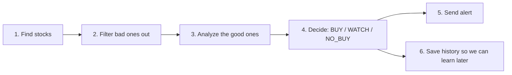

### When To Run What

Simple operator cadence:

- `daytime_flow.sh`
  - run during market hours when you want the live operator view
- `nighttime_flow.sh`
  - run after market close or overnight to refresh tomorrow’s inputs
- `backtest_flow.sh`
  - run when you want historical strategy testing, not live trade guidance
- `experimental_report_flow.sh`
  - run only when you want optional paper-only research ideas
- `experimental_maintenance_flow.sh`
  - run occasionally to settle old research snapshots and refresh calibration artifacts

Default routine:

```bash
# Night before / after close
./scripts/nighttime_flow.sh

# Next trading day
./scripts/daytime_flow.sh
```

### Streaming: When To Care

For your normal operator routine:

- keep Schwab streaming enabled by default
- run `daytime_flow.sh` and `nighttime_flow.sh` normally
- do not assume `connected no` means something is broken

Why:

- the wrappers are mainly analysis workflows
- they rely heavily on:
  - history
  - regime
  - risk
  - screening
  - Polymarket context
- those do not require a constantly active websocket

Streaming helps most when you care about:

- freshest intraday quotes
- freshest intraday snapshots
- a small set of names you want to watch closely during the session

Streaming matters less for:

- nightly discovery
- broad daytime scans
- market regime
- feature snapshots
- most of the normal wrapper output

Simple operating rule:

- default
  - keep streaming on
- debug
  - turn streaming off only when you are troubleshooting streamer behavior
- optional live-watch helper
  - separate from the wrappers
  - useful only if you want a tighter intraday read on SPY / QQQ / a short watchlist

Recommended aliases:

```bash
alias cday='cd /Users/hd/Developer/cortana-external/backtester && ./scripts/daytime_flow.sh'
alias cnight='cd /Users/hd/Developer/cortana-external/backtester && ./scripts/nighttime_flow.sh'
alias cday_nostream='cd /Users/hd/Developer/cortana-external/backtester && SCHWAB_STREAMER_ENABLED=0 ./scripts/daytime_flow.sh'
alias clive='cd /Users/hd/Developer/cortana-external/backtester && ./scripts/live_watch.sh'
alias clive4='cd /Users/hd/Developer/cortana-external/backtester && WATCH_SYMBOLS=SPY,QQQ,DIA,NVDA FOCUS_SYMBOL=SPY ./scripts/live_watch.sh'
alias cxauth='cd /Users/hd/Developer/cortana-external && ./tools/stock-discovery/sync_bird_auth.sh'
alias crefresh_watchlists='cd /Users/hd/Developer/cortana-external && ./tools/market-intel/run_market_intel.sh && ./tools/stock-discovery/trend_sweep.sh'
alias cwatch='cd /Users/hd/Developer/cortana-external/backtester && ./scripts/watchlist_watch.sh'
alias cwatch20='cd /Users/hd/Developer/cortana-external/backtester && WATCHLIST_LIMIT=20 ./scripts/watchlist_watch.sh'
```

How to think about them:

- `cday`
  - normal daytime use
  - refreshes market-intel and the X/Twitter dynamic watchlist by default before the main analysis
- `cnight`
  - normal nighttime use
- `cday_nostream`
  - debug-only comparison mode
- `clive`
  - quick live quote/snapshot glance for the default list
- `clive4`
  - quick live quote/snapshot glance for `SPY,QQQ,DIA,NVDA`
- `cxauth`
  - validate or persist private X/Twitter auth for the stock-discovery sweep
- `crefresh_watchlists`
  - force-refresh both watchlist sources before checking them live
- `cwatch`
  - quick live watchlist pulse using the latest watchlist artifacts
- `cwatch20`
  - same as `cwatch`, but with a larger top-20 list

X/Twitter auth note:

- `trend_sweep.sh` now preserves the existing dynamic watchlist when `bird` auth is unavailable
- it no longer wipes `dynamic_watchlist.json` to `0` tickers on auth failure
- by default the X/Twitter sweep now targets the OpenClaw browser profile rather than your personal Chrome profile
- `cxauth` now uses the OpenClaw browser profile first, not your personal browser session
- if OpenClaw is closed, the sync script starts it automatically before reading cookies
- if the saved private auth file is stale, `trend_sweep.sh` now reruns the sync automatically and retries once before falling back
- successful syncs are stored at:
  - `~/.config/cortana/x-twitter-bird.env`
- future `cday` / `crefresh_watchlists` runs source that file automatically
- failed or interrupted syncs now clean up their lock state automatically, so one bad run should not block later refreshes

What the optional live-watch helper means:

- it would be a tiny script or alias that directly hits the TS service for a few fresh quote/snapshot calls
- examples:
  - `/market-data/quote/SPY`
  - `/market-data/snapshot/SPY`
  - `/market-data/quote/batch`
- this is optional intraday tooling
- it is not a second main workflow and not required for the wrappers
- the repo now includes this helper as:
  - `./scripts/live_watch.sh`

What the watchlist pulse helper means:

- it is the small helper between `clive` and `cday`
- it does not rerun discovery or scan the full market
- it reads the current watchlist files, asks the TS service for fresh quotes, and tells you:
  - what is new since the last check
  - what dropped off
  - what the current watchlist names are doing right now
- use it when you want a quick answer to:
  - "what changed in my watchlist?"
  - "are my active names moving?"
- the repo now includes this helper as:
  - `./scripts/watchlist_watch.sh`

If you are SSHed into the Mac mini:

- put the aliases in the remote `~/.zshrc`
- reload your shell with `source ~/.zshrc`
- then use the aliases normally from the SSH session

### How To Read The Wrapper Output

The wrappers print a compact operator summary. The goal is:

- first show whether the data plumbing is healthy
- then show the market backdrop
- then show what the stock-selection engine decided

#### Nighttime Flow Sections

`Nightly Discovery`

- `Profile`
  - which nightly workflow profile ran
- `Market regime`
  - the current equity regime snapshot used by the discovery pass
- `Universe size`
  - how many symbols made it into the working nightly universe
- `Universe breakdown`
  - `base`
    - the TS-owned base S&P universe
  - `growth`
    - the always-include growth overlay
  - `dynamic-only`
    - symbols added only by Polymarket / X-Twitter watchlist refreshes
    - these are names not already present in the base or growth layers
  - `total`
    - the deduped nightly working set after those layers are merged
  - the nightly scan does not intentionally check the same symbol twice
  - overlap between base, growth, and dynamic inputs is removed before the actual scan runs
- `Live prefilter cache`
  - how many symbols survived the fast first-pass cache build
  - this is the early ranked-universe cache, not the final watchlist
- `Feature snapshot`
  - the cached feature set used for ranking and downstream selection
- `Liquidity overlay cache`
  - the liquidity/slippage layer used to keep the scans realistic
  - `median slip 182.1bps` means the median modeled execution slippage is about `1.821%`
  - `high quality 293` means `293` symbols passed the better-liquidity threshold
- `Buy decision calibration`
  - whether the system has settled prediction snapshots it can learn from
  - `no_settled_records` means the scoring-learning loop does not have closed outcomes yet
- `Leader baskets`
  - counts of symbols in the daily / weekly / monthly leadership buckets
- `Leaders`
  - a quick text summary of the current best leadership names if any qualified

`Market data ops`

- this is the TS service health summary
- `Live Schwab feed owner`
  - which service instance is allowed to own the live Schwab websocket if needed
- `Live feed status`
  - the Schwab websocket/live-feed layer for fresh quote/chart data
  - `connected no` does not mean the service is broken
  - it means the service is currently serving through the non-streaming path and no live stream is active right now
- `lock held no`
  - the Postgres leader lock is not currently held
  - that is okay when the service is healthy and not actively maintaining a live stream
- `Service health: healthy`
  - the market-data service itself is ready to answer requests
- `Live feed subscription budget`
  - how many live-stream symbols are currently subscribed vs the soft cap
  - `0/250 requested` means there is plenty of headroom
- `Provider usage this run`
  - `shared_state 0` means no follower-instance shared-state reads were needed
  - `primary source mix coinmarketcap 13, schwab 5562` means how often each provider served as the primary source during the run
- `Base universe source`
  - `local_json` is the normal bundled full-S&P artifact path
  - `remote_json` means you intentionally overrode the bundled artifact with a remote TS-owned universe source
  - if you still see an old cached source right after upgrading, restart the TS service so it can rebuild the artifact
- `Refresh policy`
  - reminder that TS owns the artifact refresh path and Python is only the terminal fallback

`Prediction accuracy`

- this is the self-measurement loop for the alert system
- the system logs what it said at decision time, then later checks what the stock actually did
- it measures itself at `1d`, `5d`, and `20d` horizons
- `Snapshots settled`
  - how many saved prediction snapshots have been processed into settled evaluation files
- `Records logged`
  - how many symbol-level calls exist across those settled snapshots
- `Settlement coverage`
  - `matured`
    - enough time has passed and there is a usable later bar for that horizon
  - `pending`
    - not enough time has passed yet
  - `incomplete`
    - enough time passed, but the system could not build a complete settled sample for that horizon
- `By strategy/action`
  - top-level performance by strategy and decision type
  - this answers questions like:
    - “How are Dip Buyer `BUY` calls doing after 5 days?”
    - “How often are `NO_BUY` calls actually saving us from weak names?”
- `By regime`
  - same idea, but split by market regime
  - this is how you learn whether a strategy is behaving differently in `correction` vs `confirmed_uptrend`
- `By confidence bucket`
  - same idea, but split by the model’s own confidence bucket
  - this is how you check whether high-confidence calls are actually better than low-confidence calls

Action-aware success labels:

- `buy_success_rate`
  - percent of settled `BUY` calls that were positive over that horizon
- `watch_success_rate`
  - percent of settled `WATCH` calls that ended up being directionally correct over that horizon
- `avoidance_rate`
  - percent of settled `NO_BUY` calls where avoiding the stock was the right choice because the forward return was flat/down

Risk columns:

- `avg drawdown`
  - average worst move against the call before that horizon settled
- `avg runup`
  - average best move in favor of the call before that horizon settled

If you still see `No settled prediction samples yet`:

- the logging pipeline is usually fine
- it means the system has not accumulated enough matured settled samples in the active buckets yet
- `1d` becomes useful first
- `5d` starts getting more informative after about two weeks
- `20d` is the one to take seriously after roughly a month of normal operation

#### Daytime Flow Sections

`Registry audit`

- this comes from the `market-intel` Polymarket registry
- it checks whether each configured macro theme still has working market selectors
- `healthy`
  - exact selector matches are working
- `fallback-only`
  - the exact selector failed, but fallback search still found something usable
- `broken`
  - neither exact nor fallback matching found a usable market
- `required` vs `optional`
  - required themes are core to the operator view
  - optional themes are nice to have, but not required for the workflow to run
- `exact 1 | fallback 1`
  - the registry found `1` exact match and `1` possible fallback match for that topic

`Checking market regime`

- `Distribution Days (25d): 7`
  - this is not supposed to list every recent date
  - it lists only the dates in the last `25` trading sessions that qualified as distribution days
- if today, March 24, 2026, is missing:
  - that simply means March 24 did not qualify as a distribution day by the model rules

`Leader buckets`

- `daily`
  - very recent leaders
- `weekly`
  - names repeatedly showing up over the weekly window
- `monthly`
  - broader persistent leaders
- `(2x)`
  - that symbol appeared in that bucket twice across the stored history
- `+0.0%`
  - the current stored return for that bucket window
  - if many names are `+0.0%`, that usually means the current artifact is still shallow or freshly rebuilt

`CANSLIM` and `Dip Buyer`

- `Takeaway`
  - fast operator summary of market, macro, risk, and scan-input conditions
- `Decision`
  - what the strategy actually wants to do with those conditions
- `WATCH only — correction regime blocks new dip buys`
  - the symbol(s) may be technically interesting, but the market regime is vetoing new entries

#### BTC Quick Check

Current direct-crypto setup:

- direct crypto `quote` / `snapshot` / `metadata` / `fundamentals` come from CoinMarketCap
- direct crypto `history` comes from the daily cache artifact first
- the quick-check path needs at least `30` history rows

That means:

- one refresh day = one BTC daily row
- with only a few refreshes, the system correctly says `Insufficient price data`
- with the current daily-cache-only setup, you need roughly `30` refresh days before BTC quick-check becomes meaningfully usable
- if you want that sooner, you need:
  - a CoinMarketCap plan with historical OHLCV
  - or another crypto-history provider

Wrapper note:
- `daytime_flow.sh` and `nighttime_flow.sh` now do a market-data preflight before the expensive work starts
- they check the local TS service readiness surface first
- by default they fail fast if:
  - the TS service is unreachable
  - Schwab is not configured yet
- this is intentional: it gives you a clear operator message instead of a slow degraded scan
- they also support an optional direct-crypto refresh flag:
  - `RUN_CRYPTO_DAILY_REFRESH=1`
  - optional symbols override: `CRYPTO_REFRESH_SYMBOLS=BTC,ETH`
  - the TS service refresh is idempotent for the UTC day unless you force it
- the refresh writes the direct-crypto daily cache to `.cache/market_data/crypto-daily-cache.json`
- that cache is what the service uses first for direct crypto `history` when CoinMarketCap has no historical quote support
- you can still intentionally allow degraded local runs with:
  - `REQUIRE_MARKET_DATA_SERVICE=0`
  - or `REQUIRE_SCHWAB_CONFIGURED=0`

Local Schwab OAuth note:
- the TS service now exposes a Schwab-specific local auth flow
- register this callback in the Schwab portal:
  - `https://127.0.0.1:8182/auth/schwab/callback`
- the service gives you the login URL from:
  - `GET /auth/schwab/url`
- the browser redirect lands on:
  - `GET /auth/schwab/callback`
- token state is visible from:
  - `GET /auth/schwab/status`
- this uses a local HTTPS listener because Schwab requires an `https://` callback
- use [Schwab OAuth Reauth Runbook](./schwab-oauth-reauth-runbook.md) for full re-link and troubleshooting steps

## Core Trading Flow

### Phase 1: Find Stocks

Main file:
- `/Users/hd/Developer/cortana-external/backtester/data/universe.py`

Plain-English job:
- build the list of names the system is willing to consider

This is the first question the system asks:
- "What stocks should we even look at?"

#### Where names come from

For the nightly path, the system tries sources in this order:

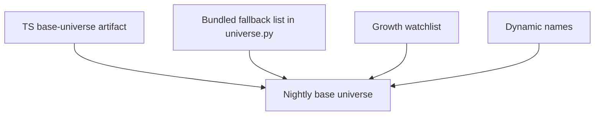

Important note:
- the TS service owns the base-universe artifact now
- the TS service can build that artifact from a source ladder:
  - configured remote JSON source
  - configured local JSON source
  - Python static seed fallback
- the long-term goal is still to replace the Python fallback with a maintained constituent source or a curated internal artifact workflow
- the bundled `SP500_TICKERS` list is only a fallback
- Python no longer scrapes Wikipedia directly for this path

#### Mental model

- `universe.py` is the scout
- it is responsible for building the candidate pool

### Phase 2: Filter Bad Ones Out

Still mainly in:
- `/Users/hd/Developer/cortana-external/backtester/data/universe.py`

Main function:
- `screen()`

Plain-English job:
- remove names that are weak, illiquid, too noisy, or not worth deeper analysis

This is the second question the system asks:
- "Which of these names are not worth more time?"

#### Screening flow

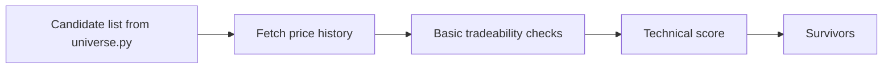

#### What gets filtered early

Examples:
- names with bad or missing price history
- names that are too cheap
- names that are too illiquid
- names that fail the minimum technical threshold

#### Technical score idea

The first-pass technical score is a simple chart-quality check:

- `N`: is the stock near highs?
- `L`: does it have momentum / leadership?
- `S`: is volume behavior supportive?

This is not yet the final trade decision.

It is just:
- "Does this chart look interesting enough to deserve deeper analysis?"

#### Phase 1 + 2 Together

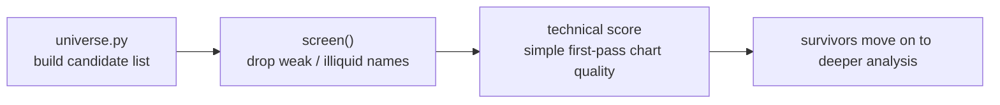

### Phase 3: Analyze Survivors

Main file:
- `/Users/hd/Developer/cortana-external/backtester/advisor.py`

Plain-English job:
- take a stock that already survived screening
- analyze it more deeply
- turn that analysis into a real recommendation

This is the third question the system asks:
- "Now that this stock looks interesting, what should we actually do with it?"

#### What advisor.py is

Simple mental model:
- `universe.py` is the scout
- `advisor.py` is the judge

`advisor.py` is the main decision engine.

It combines:
- market regime
- price history
- fundamentals
- technical signals
- strategy logic
- risk / confidence adjustments

#### Advisor Flow

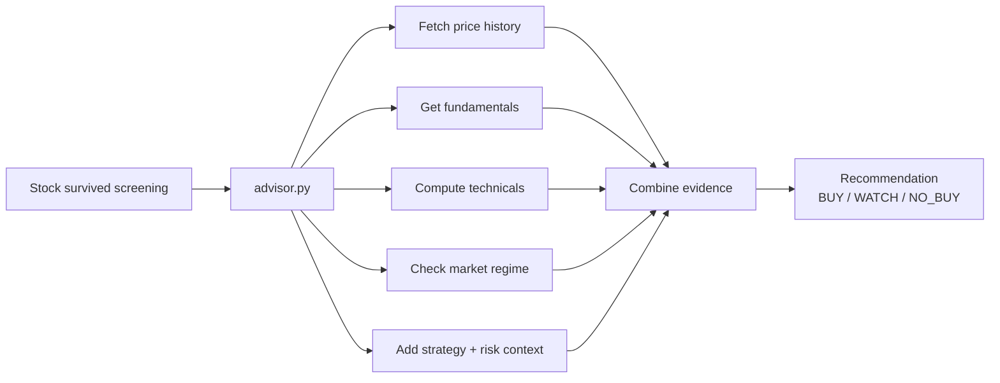

#### What advisor.py looks at

##### 1a. TS Market-Data Service Boundary

This is the biggest architecture change:

- Python is now the analysis engine
- TS is now the external-data layer

Plain-English meaning:
- Python should not worry about broker auth, websocket sessions, or fallback logic
- Python should ask one local service for normalized data
- the TS service should decide where that data came from

Simple flow:

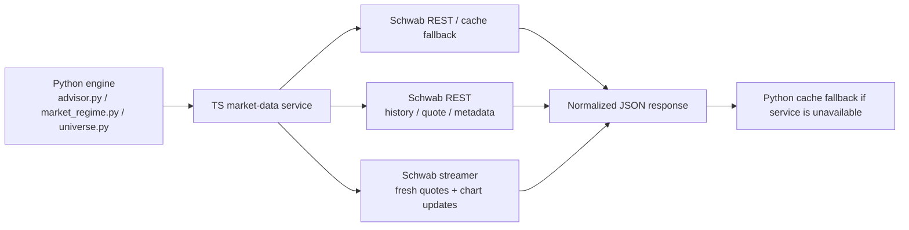

Crypto note:
- direct crypto `quote`, `snapshot`, `metadata`, and `fundamentals` now come from CoinMarketCap through the TS market-data service
- the TS service reads `COINMARKETCAP_API_KEY` and `COINMARKETCAP_API_BASE_URL` for that integration
- the current CoinMarketCap plan does not support historical crypto quotes
- to work around that, the TS service can refresh and persist one direct-crypto daily row for symbols like `BTC` and `ETH`
- that artifact lives at `.cache/market_data/crypto-daily-cache.json`
- direct crypto `history` uses the cached daily rows first and only falls back to the unsupported CoinMarketCap historical endpoint if no rows exist yet
- direct crypto `quick-check` gets better as those daily rows accumulate, but it will still be thin at the beginning of the series

The mental model is:

- Python asks: "Give me market data for this symbol."
- TS decides: "Use Schwab first, then cache if needed."
- Python then scores the stock using the normalized answer.

Why this is better:

- one place owns auth and provider bugs
- one place owns streamer sessions
- Python stays focused on scoring and decisions
- you can swap providers without rewriting strategy code

What the TS service owns now:

- Schwab REST requests
- Schwab streamer session lifecycle
- cache fallback
- risk-data fetches used by regime/risk logic
- base-universe artifact refresh
- account activity groundwork for future position awareness

What the local wrappers own now:

- quick market-data preflight before daytime/nighttime runs
- a clear local operator error when the TS service is down
- a clear local operator error when Schwab credentials are not configured yet
- optional overrides when you intentionally want cache-only behavior

What Python still owns:

- scoring
- market-regime logic
- technical analysis
- recommendation logic
- alert formatting

##### 1b. How The Schwab Streamer Fits In

The streamer exists so the TS service can keep fresher quote and chart state than plain polling.

Simple flow:

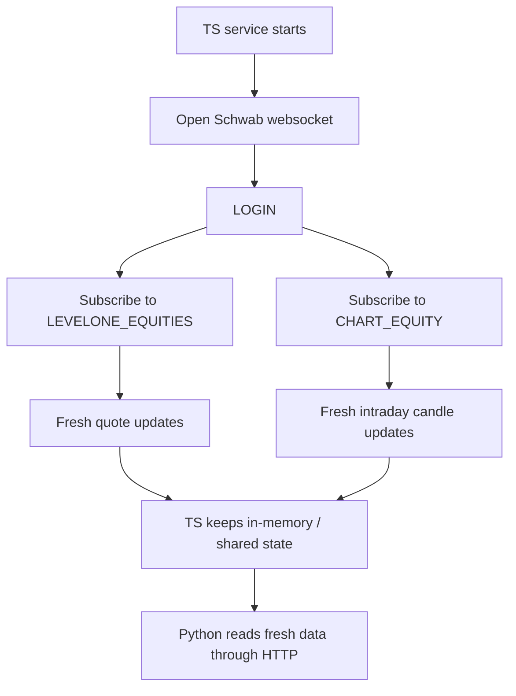

Plain-English meaning:

- `LEVELONE_EQUITIES` gives fresher quote-style updates
- `CHART_EQUITY` gives fresher intraday candle-style updates

##### 1c. How Local Schwab OAuth Works

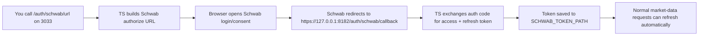

Plain-English meaning:

- `3033` is still the normal local API port
- `8182` is the local HTTPS callback listener used only because Schwab requires `https://`
- once the callback succeeds, the service stores the refresh token and starts behaving like a normal configured Schwab client
- Python never talks to the websocket directly
- Python still reads normal HTTP JSON from the TS service
- the default `LEVELONE_EQUITIES` field set is now a little richer too:
  - price
  - total volume
  - 52-week high / low
  - security status
  - net percent change

So when you run the backtester, the engine is not "streaming."
The TS service is streaming on its behalf.

##### 1c. How The Stream Stays Healthy

The streamer is not just "open a websocket and hope."

The TS service now does all of this:

- heartbeat tracking
- reconnect backoff
- explicit handling for Schwab failure codes
- serialized mutation commands so `SUBS` / `ADD` / `UNSUBS` / `VIEW` do not race
- leader/follower coordination when multiple TS instances exist
- shared quote/chart state for follower instances
- bounded in-memory cache eviction for older streamer data
- ops reporting through `/market-data/ops`
- readiness reporting through `/market-data/ready`
- cache fallback protection when repeated service failures happen

Simple health model:

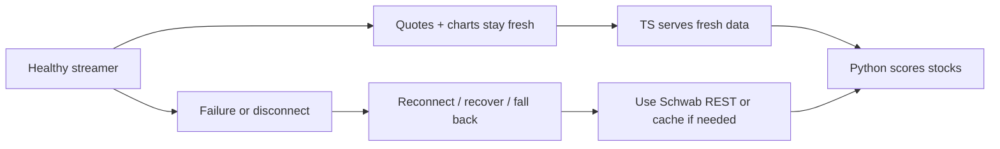

This is why the system is easier to trust now:

- fresh data is preferred
- degraded data is still available
- the engine does not need to know which recovery path happened

##### 1d. What You See As The Operator

When you run the local scripts, you are mostly seeing the result of this service boundary:

- fresher market context
- clearer source/fallback behavior
- leader/follower and ops summaries
- streamer health and symbol-budget visibility
- pre-market futures context from Schwab `LEVELONE_FUTURES` for `/ES` and `/NQ`

The compact operator reference now lives in [Market-data service reference](./market-data-service-reference.md).

##### 1. Price history

The advisor first gets recent market data for the stock.

This is used for:
- chart structure
- momentum
- breakout quality
- exit risk

This is the basic question:
- "What has the stock actually been doing?"

Important clarification:
- this now comes through the TS market-data service boundary described above
- normal history requests now honor `interval=1d|1wk|1mo`
- diagnostic and batch request shapes are documented in [Market-data service reference](./market-data-service-reference.md)

##### 2. Fundamentals

The advisor pulls fundamental data like:
- earnings growth
- annual growth
- institutional ownership
- share / float context

This is the basic question:
- "Is the business strong enough to support the chart?"

Important clarification:
- fundamentals and symbol metadata are now normalized by the TS service before Python scores them
- annual EPS growth is now horizon-aware again on the Python side when earnings history is available:
  - if the service payload contains usable earnings-history rows, Python rebuilds the requested N-year CAGR locally
  - if only the normalized summary field exists, Python only trusts that as the default 5-year-style annual growth value and returns `None` for other requested horizons instead of pretending they are all the same

##### 3. Technicals

The advisor also scores the stock technically.

This includes:
- proximity to highs
- momentum
- volume behavior
- breakout follow-through

This is the basic question:
- "Does the chart still look healthy?"

##### 4. Market regime

The advisor checks the overall market before trusting the stock.

This matters because:
- a decent stock setup can still be a bad buy in a weak market
- the system is allowed to be more aggressive in strong market conditions
- the system should be more cautious in corrections

This is the basic question:
- "Even if the stock looks good, are market conditions good enough?"

Important clarification:
- market regime logic still lives in Python
- but its raw inputs now come from the TS service risk endpoints
- those TS risk endpoints own the external fetches for Schwab/FRED/CBOE

Simple version:
- market regime = "How healthy is the market?"
- Polymarket = "Is there extra macro/event context worth noting?"

##### 5. Risk / confidence / overlays

The advisor also adjusts the final recommendation using:
- confidence
- uncertainty
- trade quality
- churn / downside penalties
- optional overlays

This is the basic question:
- "How much should we trust this setup?"

Where this comes from:
- confidence / uncertainty / trade quality come from the Python confidence-scoring layer
- downside / churn penalties come from the Python trade-quality and risk logic
- market regime stress comes from the Python market-regime and adverse-regime logic
- optional overlays come from extra bounded Python overlay helpers like risk-budget or execution-quality context

Simple version:
- confidence = how strong the setup looks after combining the evidence
- uncertainty = how noisy or unreliable the setup may be
- trade quality = overall quality after penalties and context
- overlays = extra bounded adjustments, not full decision authority

#### The output of advisor.py

At the end, the advisor produces a recommendation:

- `BUY`
- `WATCH`
- `NO_BUY`

That recommendation is what later gets turned into:
- alert messages
- watchlists
- quick-check results

#### How Analysis Becomes Action

This is the key transition inside `advisor.py`:
- first the system gathers evidence
- then the recommendation engine turns that evidence into an action

Simple flow:

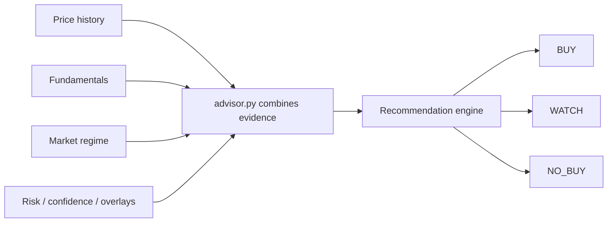

Plain-English meaning:
- `BUY` = strong enough to act on now
- `WATCH` = interesting, but not strong enough yet
- `NO_BUY` = not a current setup

This is important:
- the system is not just looking at one score
- it is combining multiple kinds of evidence and then making a rule-based decision

Examples of what can push a stock toward `BUY`:
- strong total score
- healthy chart
- supportive market regime
- better confidence / trade quality

Examples of what can keep it at `WATCH`:
- some good signs, but not enough confirmation
- setup is interesting but still early
- decent stock, but not enough conviction yet

Examples of what can push it to `NO_BUY`:
- weak market regime
- bad risk / confidence profile
- weak or broken chart
- not enough supporting evidence overall

Important mental model:
- a stock can be a good company and still be `NO_BUY`
- a stock can look interesting and still only be `WATCH`
- the system is trying to answer:
  - "Is this a setup I should act on now?"

### Phase 4: Delivery Layer

Main files:
- `/Users/hd/Developer/cortana-external/backtester/canslim_alert.py`
- `/Users/hd/Developer/cortana-external/backtester/dipbuyer_alert.py`
- `/Users/hd/Developer/cortana-external/backtester/advisor.py --quick-check`

Plain-English job:
- take the internal decision and turn it into something the operator can actually read

This is the next question the system asks:
- "How should this decision be shown to me?"

#### Delivery Flow

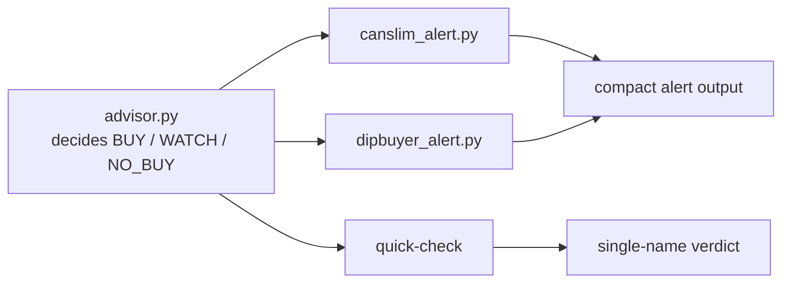

#### Why there are multiple outputs

The system does not have only one output format because not every use case is the same.

Different operator questions need different surfaces:

- "Give me the CANSLIM-style stock summary."
- "Give me the dip-buyer summary."
- "Tell me quickly if this one name is worth attention."

So the delivery layer is not making new decisions.

It is taking the decision that already exists and packaging it in the right format.

#### CANSLIM alert

File:
- `/Users/hd/Developer/cortana-external/backtester/canslim_alert.py`

Plain-English meaning:
- this is the compact summary for the CANSLIM-style path

Use it when you want:
- a summarized list of the strongest CANSLIM-style setups

New operator wording:
- `Alert posture`
  - the alert’s urgency label
  - in a `correction`, this is intentionally phrased as `review only` or `stand aside`
  - that is there to prevent downstream wrappers from turning a defensive watchlist update into a fake buy-now alert

#### Dip Buyer alert

File:
- `/Users/hd/Developer/cortana-external/backtester/dipbuyer_alert.py`

Plain-English meaning:
- this is the compact summary for the buy-the-dip path

Use it when you want:
- a summarized list of dip-style setups and watch names

Confidence wording:
- `Calibration note`
  - tells you whether confidence is already backed by settled outcomes
  - `uncalibrated`
    - the signal can still be useful
    - but the confidence number should be read as model-estimated, not yet proven by closed outcomes

#### Quick-check

Surface:
- `uv run python advisor.py --quick-check SYMBOL`

Plain-English meaning:
- this is the fastest single-name verdict path

Use it when you want:
- one bounded answer for one stock, proxy, or coin

Examples:

```bash
uv run python advisor.py --quick-check NVDA
uv run python advisor.py --quick-check BTC
```

#### Simple mental model

- `advisor.py` is the brain
- alert scripts are the messenger
- `quick-check` is the fastest one-name messenger

The important idea:
- the alert layer usually does not decide what to buy
- it tells you what the decision engine already concluded

### Phase 5: Learning Loop

Main files:
- `/Users/hd/Developer/cortana-external/backtester/experimental_alpha.py`
- `/Users/hd/Developer/cortana-external/backtester/buy_decision_calibration.py`

Plain-English job:
- save what the system thought before
- come back later and measure what actually happened
- summarize whether those old ideas were useful

This is the next question the system asks:
- "Were our earlier ideas actually right?"

#### Learning Loop Flow

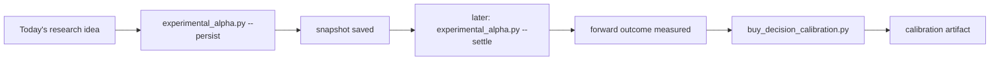

#### Step 1: Persist

Command:

```bash
uv run python experimental_alpha.py --persist
```

Plain-English meaning:
- save today’s research candidates to disk
- remember what the system thought at that moment

Simple version:
- "Today, these were the ideas."

#### Step 2: Settle

Command:

```bash
uv run python experimental_alpha.py --settle
```

Plain-English meaning:
- go back to saved snapshots later
- check what happened after those snapshots
- measure forward returns

Simple version:
- "Were those old ideas actually good?"

#### Step 3: Calibrate

Command:

```bash
uv run python buy_decision_calibration.py
```

Plain-English meaning:
- summarize the settled history
- measure hit rate, return behavior, and whether there is enough evidence to trust the patterns

Simple version:
- "What have we learned from the old ideas?"

#### Simple mental model

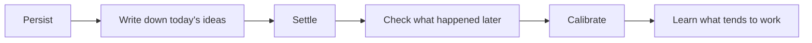

#### Why `no_settled_records` happens

Sometimes the calibration artifact exists but still says:
- `record_count: 0`
- `settled_candidates: 0`
- `reason: no_settled_records`

That usually means:
- the file was created correctly
- but there are no old research snapshots with settled outcomes yet

When that happens, daytime alerts now say:
- `Calibration note: uncalibrated`

Read that as:
- the scan still works
- the ranking still works
- but the confidence value is not yet validated by enough settled history

So this does **not** automatically mean:
- the pipeline is broken

It usually means:
- the notebook exists
- but it is still empty

#### Why this matters

Without the learning loop, the system can only say:
- "Here is what I think right now."

With the learning loop, the system can eventually say:
- "Here is what I think right now, and here is how similar past ideas actually performed."


### Nightly Leader Buckets vs Live Watchlists

This is a separate concept from the final Dip Buyer or CANSLIM watchlist.

Simple flow:

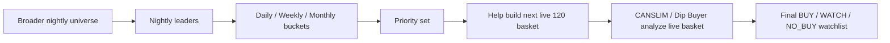

Plain-English meaning:
- nightly leader buckets are **leadership memory**
- final CANSLIM / Dip Buyer watchlists are **live decision output**

What that means:
- a name in `daily`, `weekly`, or `monthly` helped shape who got extra attention in the next live scan
- but it does **not** automatically mean that name must appear in the final Dip Buyer watchlist
- the final watchlist still comes from the strategy engine after it analyzes the live 120 basket

Mental model:
- leader buckets = "who keeps showing leadership over time?"
- final watchlist = "who looks actionable or worth watching right now?"

How to read the bucket lines:
- `OXY +3.2% (1x)`
  - `+3.2%` = the move over that bucket window
  - `(1x)` = OXY has appeared once in that bucket window so far
- `OXY +8.4% (4x)`
  - the move is stronger over the weekly window
  - and the name has shown up repeatedly, which means stronger persistence

Why both fields matter:
- `% move` tells you how strong the move has been
- `(x appearances)` tells you whether the move is persistent or just a one-off pop

## Putting It Together

### Full System Diagram

This is the full end-to-end view of what we built.

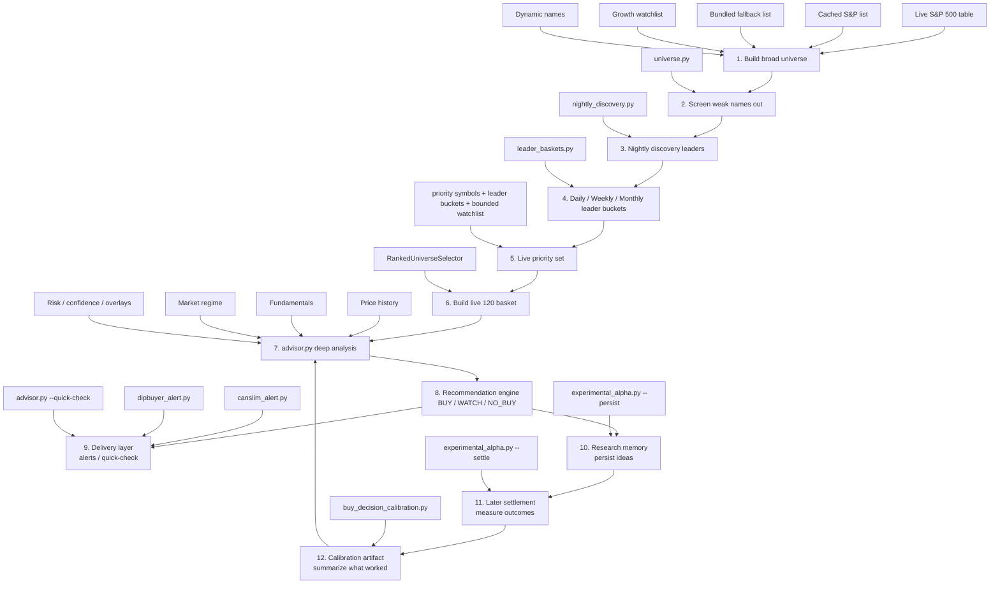

### How Important `.cache` Is

The `.cache` directory is operationally important, but it is not the same thing as source code.

Simple mental model:
- code = the brain
- `.cache` = working memory and prepared inputs
- `var/` and run artifacts = the historical diary of what actually happened

What usually lives in `.cache`:
- refreshed market-regime snapshots
- research snapshots and settled outcomes
- calibration artifacts
- other rebuildable intermediate files used to make the system faster, fresher, or more consistent

What happens if `.cache` is missing:
- the repo is not ruined forever
- many files can be rebuilt by rerunning the normal commands
- but the live system may become slower, less informed, or forced into fallback behavior until those files are refreshed again

Practical importance by category:
- important for live quality and speed:
  feature snapshots, liquidity overlays, regime snapshots
- important for learning/history:
  experimental alpha snapshots, settled outcomes, calibration inputs
- usually rebuildable:
  temporary fetch outputs and intermediate cache files

So the right mental model is:
- `.cache` is not source code
- but it is still very important operational memory
