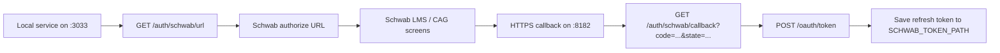

# Schwab OAuth Reauthentication Runbook

Use this runbook when:
- the Schwab refresh token is missing
- the refresh token is rejected
- `/market-data/quote/:symbol` starts failing with Schwab auth errors
- a new agent needs to re-link the local market-data service to Schwab without relying on old chat context

This is the source of truth for the local Schwab three-legged OAuth flow used by the TS market-data service.

## Quick Model



## What Good Looks Like

Successful end state:
- `GET /auth/schwab/status` shows `refreshTokenPresent: true`
- `/Users/hd/Developer/cortana-external/.cache/market_data/schwab-token.json` exists
- `GET /market-data/quote/SPY` returns `source: "schwab"`
- `/market-data/ops` shows:
  - `providers.schwab: "configured"`
  - recent `lastTokenRefreshAt`

## Required Local Config

These values must exist in `/Users/hd/Developer/cortana-external/.env`:

```env
SCHWAB_CLIENT_ID=...
SCHWAB_CLIENT_SECRET=...
SCHWAB_TOKEN_PATH=.cache/market_data/schwab-token.json
SCHWAB_REDIRECT_URL=https://127.0.0.1:8182/auth/schwab/callback
EXTERNAL_SERVICE_TLS_PORT=8182
EXTERNAL_SERVICE_TLS_CERT_PATH=/Users/hd/Developer/cortana-external/.certs/127.0.0.1.pem
EXTERNAL_SERVICE_TLS_KEY_PATH=/Users/hd/Developer/cortana-external/.certs/127.0.0.1-key.pem
SCHWAB_STREAMER_ROLE=leader
SCHWAB_STREAMER_SHARED_STATE_BACKEND=postgres
```

Important details:
- Schwab app key = `SCHWAB_CLIENT_ID`
- Schwab app secret = `SCHWAB_CLIENT_SECRET`
- the callback URL must be HTTPS
- use `127.0.0.1`, not `localhost`

## Required Schwab Portal Config

Schwab app callback URL:

```text
https://127.0.0.1:8182/auth/schwab/callback
```

Requirements:
- it must match the runtime `redirect_uri` exactly
- no `:3033`
- no trailing slash
- if the app has multiple callback URLs, this exact one must be present

Important operational note:
- app callback URL changes can put the app into `Modification Pending`
- during that period, the CAG screens may appear but the final redirect can fail
- wait until the app is back to `Ready For Use` before debugging local code further

## Startup Checklist

Start the TS service:

```bash
cd /Users/hd/Developer/cortana-external/apps/external-service
pnpm start
```

Confirm HTTP and HTTPS listeners:

```bash
curl -s http://127.0.0.1:3033/auth/schwab/status
curl -ks https://127.0.0.1:8182/auth/schwab/status
```

Expected:
- both endpoints return JSON
- `clientConfigured: true`
- `tlsConfigured: true`

If `8182` is not responding:
- the service did not load the TLS env vars
- or the service was not restarted after updating `.env`

## Exact Reauthentication Flow

1. Generate a fresh Schwab authorize URL:

```bash
curl -s http://127.0.0.1:3033/auth/schwab/url | jq -r '.data.url'
```

2. Copy only the returned URL.

Do not copy the surrounding JSON.

3. Open that exact URL in a browser.

4. Complete the Schwab LMS / CAG flow:
- sign in
- select the account(s) to link
- review the selected accounts
- click `Done`

5. After `Done`, Schwab should redirect to something like:

```text
https://127.0.0.1:8182/auth/schwab/callback?code=...&state=...
```

6. Verify token save:

```bash
curl -s http://127.0.0.1:3033/auth/schwab/status
```

Expected:
- `refreshTokenPresent: true`
- `lastAuthorizationCodeAt` set

7. Verify live Schwab data:

```bash
curl -s http://127.0.0.1:3033/market-data/quote/SPY
```

Expected:
- `source: "schwab"`

## Browser Notes

The local callback uses a self-signed cert.

What to do:
- open `https://127.0.0.1:8182/auth/schwab/status` once in the browser
- accept the certificate warning if prompted
- confirm the page loads
- then retry the OAuth flow with a fresh `/auth/schwab/url`

This is only for local dev. `curl -k` works even if the browser does not trust the cert.

## Known Good Runtime Signals

`GET /auth/schwab/status` should look like:
- `refreshTokenPresent: true`
- `accessTokenExpiresAt: <timestamp>`
- `refreshTokenIssuedAt: <timestamp>`
- `lastAuthorizationCodeAt: <timestamp>`

`GET /market-data/ops` should show:
- `providers.schwab: "configured"`
- non-null `lastTokenRefreshAt` after a refresh event
- `schwabTokenStatus: "ready"`

## Refresh-Token Validation

This is the safest validation sequence:

1. Confirm normal auth state:

```bash
curl -s http://127.0.0.1:3033/auth/schwab/status
```

2. Confirm a live Schwab request works:

```bash
curl -s http://127.0.0.1:3033/market-data/quote/SPY
```

3. If you intentionally test refresh behavior, force the access token to expire on disk, then hit a live Schwab route again.

Success signals:
- access token changes
- refresh token remains present
- quote still returns from Schwab
- `/market-data/ops` updates `lastTokenRefreshAt`

## Failure Modes and What They Mean

### `refreshTokenPresent: false`

Meaning:
- token save never happened
- token file is missing
- OAuth flow did not complete

Check:
- did the browser actually hit `https://127.0.0.1:8182/auth/schwab/callback?...`
- was the authorize URL fresh?

### `lastAuthorizationCodeAt: null`

Meaning:
- no authorization code was ever received by the local callback

This is the key signal that the failure happened before token exchange.

### Schwab CAG screens appear, but `Done` returns to Schwab sign-in

Meaning:
- account-linking UI happened
- final redirect back to Cortana did not happen

Most likely causes:
- app is in `Modification Pending`
- callback URL mismatch in portal vs runtime
- browser did not accept the local HTTPS callback

### `schwab oauth state mismatch`

Meaning:
- the callback was hit, but the service no longer recognized the pending OAuth `state`

Common causes:
- stale authorize URL
- service restarted between `/auth/schwab/url` and callback

Fix:
- generate a fresh auth URL
- do not restart the service during the flow

### `Schwab refresh token rejected (401/403)`

Meaning:
- the saved refresh token is no longer accepted

Treat this as:
- human action required
- rerun the full local OAuth flow

### Quote route returns `Schwab credentials are not configured`

Meaning:
- no refresh token is available to mint an access token
- or client credentials are missing

Check:
- `SCHWAB_CLIENT_ID`
- `SCHWAB_CLIENT_SECRET`
- `SCHWAB_TOKEN_PATH`
- `/auth/schwab/status`

## Known Pitfalls

- Do not use `localhost` for Schwab callback registration.
- Do not use `:3033` as the callback port.
- Do not copy the entire JSON response from `/auth/schwab/url`; copy only `.data.url`.
- Do not reuse an old authorize URL after waiting too long.
- Do not restart the service between generating `/auth/schwab/url` and completing the callback.
- If the app status is `Modification Pending`, wait until it returns to `Ready For Use`.

## End-to-End Verification Commands

```bash
curl -s http://127.0.0.1:3033/auth/schwab/status
curl -ks https://127.0.0.1:8182/auth/schwab/status
curl -s http://127.0.0.1:3033/market-data/quote/SPY
curl -s http://127.0.0.1:3033/market-data/ops
```

Interpretation:
- if status says `refreshTokenPresent: true` and quote returns `source: "schwab"`, local auth is working
- if `/market-data/ops` shows `providers.schwab: "configured"`, the service is in the correct operating state

## Fast Handoff For Another Agent

If a new agent has to debug Schwab auth, tell it to start here:

1. Read:
   - `/Users/hd/Developer/cortana-external/backtester/docs/schwab-oauth-reauth-runbook.md`
   - `/Users/hd/Developer/cortana-external/backtester/docs/market-data-service-reference.md`
   - `/Users/hd/Developer/cortana-external/backtester/docs/session-handoff.md`
2. Confirm:
   - `/auth/schwab/status`
   - local HTTPS callback on `8182`
   - app callback exact-match in Schwab portal
3. Determine whether failure is:
   - before callback
   - at callback/state validation
   - at token exchange
   - or at refresh time
