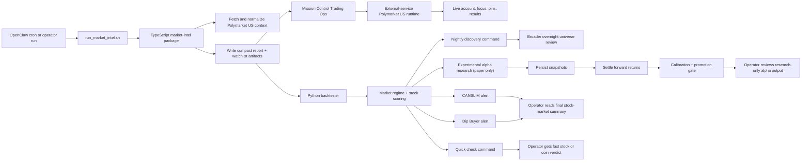

# Polymarket + Backtester Flow

This page is the simplest current source view of how Polymarket US now fits into the stock-analysis and operator surfaces.

## Plain-English version

- OpenClaw or an operator starts the scheduled run.
- The `run_market_intel.sh` bridge runs the TypeScript Polymarket intelligence layer first.
- That layer now targets Polymarket US and writes artifact files that both the Python backtester and Mission Control can consume.
- External-service owns the authenticated US account path, live market/private snapshots, top-event/top-sports discovery, pin persistence, and results/economics.
- Mission Control Trading Ops uses those runtime surfaces to show live Polymarket boards, pinned markets, linked watchlists, and settled/open results.
- The Python backtester still reads Polymarket artifacts as context for the equity regime, stock scoring, quick checks, nightly discovery, and paper-only alpha research.
- The final thing the operator sees is still a stock-market summary or research surface, but now with Polymarket-aware context and a live Polymarket operator surface beside it.

## Mental model

- OpenClaw: scheduler / runner
- TypeScript market-intel: macro/event intelligence and artifact generation
- External-service: authenticated Polymarket US runtime layer
- Mission Control: live operator surface for account, focus boards, pinned markets, and results
- Python backtester: stock analysis and alert generation
- Nightly discovery: broader overnight candidate sweep
- Experimental alpha research: paper-only validation surface with persistence, settlement, and promotion gates

## Current boundary

This stack is currently:

- live
- authenticated
- monitored
- backtester-aware

It is not yet:

- an order-entry system
- a Polymarket-specific decision engine
- a thesis/paper-trade recorder for prediction-market orders

Those next steps are tracked in:

- `backtester/docs/source/roadmap/polymarket-v2-trade-loop.md`
- `knowledge/domains/integrations/polymarket-us.md`
