# Polymarket V2 Trade Loop

This page is the source roadmap for the next Polymarket phase: moving from read-only monitoring to a controlled trade-entry loop with decision support.

## Goal

Let the operator place Polymarket US trades from Trading Ops with the same discipline used for stock watchlists and Telegram-delivered decision records.

The important difference from v1 is that v2 is not just a market browser. It is an operator workflow:

- inspect a live contract
- see why it matters
- review evidence and risk
- preview the order
- submit intentionally
- keep the thesis and outcome on file

## Recommended sequencing

The direction in this roadmap is right, but the order matters.

V2 should not start with a live trade button. It should start with a decision-support loop:

1. `trade dossier`
2. `opinion`
3. `preview`
4. `submit`
5. `tracking`
6. `postmortem`

That keeps the first live-trading version disciplined and inspectable.

## V2 pillars

### 1. Trade dossier

Before order entry, every candidate contract should have a compact operator dossier.

This should exist even if the operator never submits the trade.

Minimum contents:

- contract title, slug, event, and resolution condition
- live bid / ask / spread / last / open interest / volume
- recent roster status and whether the contract is newly rotating onto the board
- linked macro/watchlist context from market-intel
- related equity proxies when relevant (`SPY`, `QQQ`, `DIA`, sector ETFs, linked stocks)
- supporting and conflicting facts
- explicit risks and invalidation conditions

### 2. Decision support

The current backtester decision engine is stock-first. V2 should add a prediction-market opinion layer that is still evidence-led.

Possible outputs:

- `pass`
- `watch`
- `small starter`
- `sized conviction`

That output should be justified by:

- market structure
- catalyst timing
- liquidity/spread quality
- historical context from similar contracts
- alignment or conflict with the equity regime

The opinion layer should be hybrid:

- deterministic scorecard first
- compact LLM explanation second

The LLM should explain the facts, not invent the trade.

### 3. Order workflow

Add a server-owned order path in external-service:

- preview order
- submit order
- cancel order
- close position support

Guardrails should live server-side only.

### 4. Record keeping

Polymarket trade decisions should produce durable artifacts the same way stock watchlists and Telegram messages do.

Suggested artifact families:

- thesis snapshot
- order preview snapshot
- submitted order record
- position review snapshot
- settled outcome / postmortem

Suggested home:

- `var/polymarket/`
- or a dedicated sub-tree under the existing backtest/run artifact layout

I would lean toward a dedicated Polymarket run family rather than forcing these records into the stock run layout. The two systems should be linked, but not collapsed into the same lifecycle.

## Proposed operator flow

```mermaid
flowchart LR
    A["Top events / Top sports card"] --> B["Open trade dossier"]
    B --> C["Build evidence packet"]
    C --> D["Show AI / rules-based opinion"]
    D --> E["Preview order in external-service"]
    E --> F["Operator confirms side, price, size"]
    F --> G["Submit order"]
    G --> H["Persist thesis + order artifact"]
    H --> I["Track live position in Mission Control"]
    I --> J["Write settled result + postmortem"]
```

## Opinion engine ideas

The decision-support layer does not need to be fully generative at first.

A practical first version is hybrid:

- deterministic facts and thresholds first
- compact LLM synthesis second

Example structure:

1. Rules produce a structured scorecard.
2. The LLM explains the scorecard in operator language.
3. The final UI shows both the facts and the summary opinion.

That keeps the system inspectable and avoids a pure-vibes trade assistant.

## Suggested first V2 slice

The first safe slice should be:

- read-only trade dossier
- opinion scorecard
- order preview only
- no live order submit from the browser yet
- full evidence packet
- explicit max-notional and market-state validation
- thesis artifact written to disk
- Telegram-ready summary rendering for the operator

After that:

- live submit
- cancel
- position review
- settlement / postmortem

This means the first V2 milestone is decision quality, not button wiring.

## Open questions

- Where should Polymarket order artifacts live relative to the current backtester run structure?
- Should a Polymarket thesis be attached to a stock-market session run, or be its own run family?
- What are the minimum risk controls before live submit is allowed?
- Which parts should be deterministic only, and which should be LLM-assisted?
- How should Telegram/operator summaries differ between preview, submit, live position, and settled result?
