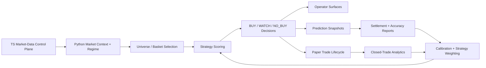

# Backtester Roadmap

This document is the master build plan for turning `cortana-external` from a strong market-analysis and alerting system into a full prediction and decision engine.

It is intentionally specific.

Use it to answer:
- what exists today
- what must not change
- what is still missing
- what gets built next
- which files and artifacts each phase should touch
- how to add features without breaking the system shape
- what "done" means for each major phase

This roadmap replaces the older observation-only version. It keeps the useful operator cadence, but extends it into an implementation and scaling plan.

## North Star

The long-term goal is not just:
- "scan stocks and send alerts"

The long-term goal is:
- maintain a reliable market-intelligence layer
- generate evidence-backed `BUY / WATCH / NO_BUY` decisions
- track those decisions through full paper-trade lifecycles
- settle outcomes automatically
- calibrate confidence and sizing from real results
- support `buy / hold / trim / sell` judgment
- degrade clearly and safely when live data is weak
- remain understandable to the operator at every step

The system should eventually be able to say:
- `Buy NVDA now`
- `Hold MSFT; thesis intact`
- `Trim META; momentum intact but extension risk is elevated`
- `Sell AAPL now; exit reason: target hit and breadth deteriorated`
- `This class of trade is currently working / not working`

## Scope

This roadmap covers:
- `apps/external-service`
- `backtester`
- `watchdog`
- the contracts consumed by the main `cortana` repo

This roadmap does not cover:
- live brokerage execution
- tax/accounting logic
- portfolio accounting beyond the future paper-portfolio layer
- discretionary UI product surfaces outside the current operator scripts and cron messages

## Current System Baseline

### Repo Boundaries

The system is already split correctly. Preserve this split.

`apps/external-service` owns:
- Schwab auth and token lifecycle
- Schwab quote / snapshot / history access
- Schwab streamer supervision
- CoinMarketCap crypto access
- FRED / CBOE / base-universe artifact ownership
- market-data health and ops endpoints
- external integration control-plane behavior

`backtester` owns:
- market regime logic
- universe construction and selection
- leader-basket generation
- CANSLIM and Dip Buyer analysis
- intraday breadth logic
- market brief snapshot generation
- prediction logging and settlement
- paper-trade lifecycle
- operator wrappers and local output formatting

`watchdog` owns:
- runtime health checks
- bounded self-heal behavior
- operator alerts for degraded or broken lanes

The main `cortana` repo owns:
- cron orchestration
- Telegram delivery
- consumption of compact exported artifacts
- top-level runtime coordination

### Current Operator Surfaces

These are the current primary entrypoints and should be preserved:

- `./scripts/daytime_flow.sh`
- `./scripts/nighttime_flow.sh`
- `./scripts/backtest_flow.sh`
- `./scripts/live_watch.sh`
- `./scripts/watchlist_watch.sh`
- `uv run python market_brief_snapshot.py --operator`
- `uv run python canslim_alert.py --limit 8 --min-score 6`
- `uv run python dipbuyer_alert.py --limit 8 --min-score 6`

Useful aliases already map to these surfaces:
- `cday`
- `cnight`
- `cbreadth`
- `cbreadth_raw`
- `cdip`
- `clive`
- `cwatch`

The roadmap should extend these surfaces, not replace them with a new monolithic operator entrypoint.

### Current System Strengths

The current system already has meaningful capability:

- TS-owned market-data and base-universe control plane
- Python-owned analysis and decision layer
- resilient degraded-mode behavior with bounded stale fallback
- nightly discovery and leader buckets
- live basket construction
- CANSLIM and Dip Buyer strategy outputs
- compact stock-market brief export for cron
- intraday breadth override foundation
- prediction logging and 1d/5d/20d settlement
- paper-trade lifecycle foundation
- watchdog coverage for the market-data lane
- stronger operator-facing wording around degraded states

This is no longer a toy scanner.

### Current Gaps

The current gaps are what separate a strong analysis engine from a full prediction bot:

- confidence is not yet truly calibrated
- the Python engine is still more rule-composed than stateful, memory-driven, and adaptive
- the prediction loop is not yet explicit enough about confidence vs risk, validation, and recalibration
- entry classification is ahead of execution-ready entry planning
- entry logic is ahead of exit logic
- hold / trim / sell reasoning is not first-class yet
- paper-trade lifecycle is present but still immature
- strategy weighting is not evidence-driven yet
- vetoes are not measured deeply enough
- opportunity-cost misses are not first-class metrics yet
- X and Polymarket are useful discovery/context inputs, but they are not yet formalized as a bounded narrative overlay layer
- a first-class asynchronous research plane is not formalized yet, especially for earnings, catalysts, transcripts, and forward-looking theme work
- position sizing is still shallow
- portfolio-aware reasoning is intentionally absent
- experiment promotion / challenger governance is not formalized
- cross-repo artifact contracts need more versioning and stronger truth semantics

## Non-Negotiable Principles

Every future change should obey these rules.

### 1. Preserve Ownership Boundaries

Do not collapse TS and Python responsibilities.

TS remains the owner of:
- external market-data integrations
- broker auth
- streamer state
- provider health
- base-universe refresh
- shared runtime state

Python remains the owner of:
- analysis
- scoring
- ranking
- regime logic
- selection logic
- calibration
- lifecycle evaluation
- market brief interpretation

### 2. No Silent Degradation

The system must never silently turn:
- broken data into fake confidence
- degraded scans into empty watchlists without explanation
- missing candidates into "unavailable"
- emergency fallback into language that sounds fresh

Every major surface must distinguish:
- `healthy`
- `degraded-safe`
- `degraded-risky`
- `failed`

### 3. Artifacts Are The Source Of Truth

The system is only as trustworthy as its persisted artifacts.

Decisions must be inspectable through:
- local workflow output bundles
- market regime snapshots
- leader bucket artifacts
- prediction snapshots
- settled accuracy artifacts
- paper-trade ledgers
- run manifests
- cron run artifacts in `cortana`

### 4. Every New Feature Must Ship With Measurement

A feature is not complete if it only changes behavior.

Each major feature must also define:
- the artifact it writes
- the operator surface it affects
- the health semantics it exposes
- the tests it requires
- the metrics that decide whether it stays

### 5. Degrade Conservative, Not Optimistic

When live data is weak:
- do not promote risk
- do not imply freshness
- do not synthesize unjustified buy authority
- prefer bounded cached context plus explicit warnings

### 6. Build For Extension, Not Rewrites

New strategies, new overlays, and new data sources should plug into the existing system through:
- clear contracts
- registries
- versioned artifacts
- explicit health semantics
- replayable tests

### 7. Point-In-Time Truth Over Convenience

Any feature used for research, replay, or promotion decisions must reflect what the system could actually have known at the time.

This means:
- point-in-time membership where needed
- causal timestamps
- explicit `known_at` semantics
- no silent use of later-updated artifacts in historical evaluation

## Target End State

The target end state has ten major capabilities:

1. Reliable market context
- regime
- tape
- breadth
- macro
- risk budget
- freshness and health metadata

2. Reliable candidate generation
- broad discovery
- live basket construction
- repeat leadership memory
- strategy-ready candidate sets

3. Strong decision engine
- strategy-aware `BUY / WATCH / NO_BUY`
- execution-ready entry plans
- bounded intraday exceptions
- calibrated confidence
- evidence-weighted vetoes

4. Full trade lifecycle
- entry
- hold
- trim
- exit
- realized P&L
- per-trade audit trail

5. Closed-loop measurement
- forward-return settlement
- drawdown/runup tracking
- regime-bucket analysis
- confidence calibration
- action-aware grading
- prediction validation and recalibration

6. Adaptive strategy weighting
- strategy performance by regime
- veto effectiveness
- opportunity-cost accounting
- confidence-to-size mapping

7. Decision brain layer
- explicit market, symbol, narrative, and position state
- memory of prior setups, trade outcomes, and theme behavior
- uncertainty-aware decisioning
- policy separation for buy / watch / no-buy / hold / trim / sell
- adaptation from settled outcomes

8. Narrative discovery and context overlay
- X-driven ticker discovery
- Polymarket-driven theme discovery
- repeated / accelerating / crowded narrative detection
- bounded confidence nudges for already-valid setups
- crowding warnings for low-quality or overheated names

9. Asynchronous research plane
- earnings and catalyst calendar
- transcript and guidance summaries
- research artifacts for future themes and sector shifts
- async hot / warm / cold research lanes
- no blocking of the live decision path

10. Stable operator surfaces
- truthful market brief
- truthful strategy alerts
- truthful cron summaries
- reliable degraded semantics
- low-noise watchdog

## Core Architecture Map

Key files in the current architecture:

TS control plane:
- `/Users/hd/Developer/cortana-external/apps/external-service/src/market-data`
- `/Users/hd/Developer/cortana-external/apps/external-service/src/auth`
- `/Users/hd/Developer/cortana-external/apps/external-service/src/config.ts`

Python analysis:
- `/Users/hd/Developer/cortana-external/backtester/advisor.py`
- `/Users/hd/Developer/cortana-external/backtester/canslim_alert.py`
- `/Users/hd/Developer/cortana-external/backtester/dipbuyer_alert.py`
- `/Users/hd/Developer/cortana-external/backtester/nightly_discovery.py`
- `/Users/hd/Developer/cortana-external/backtester/market_brief_snapshot.py`

Core data/scoring:
- `/Users/hd/Developer/cortana-external/backtester/data/market_data_provider.py`
- `/Users/hd/Developer/cortana-external/backtester/data/market_regime.py`
- `/Users/hd/Developer/cortana-external/backtester/data/universe.py`
- `/Users/hd/Developer/cortana-external/backtester/data/universe_selection.py`
- `/Users/hd/Developer/cortana-external/backtester/data/leader_baskets.py`
- `/Users/hd/Developer/cortana-external/backtester/data/intraday_breadth.py`
- `/Users/hd/Developer/cortana-external/backtester/data/confidence.py`
- `/Users/hd/Developer/cortana-external/backtester/data/liquidity_overlay.py`
- `/Users/hd/Developer/cortana-external/backtester/data/feature_snapshot.py`

Evaluation:
- `/Users/hd/Developer/cortana-external/backtester/evaluation/prediction_accuracy.py`
- `/Users/hd/Developer/cortana-external/backtester/prediction_accuracy_report.py`
- `/Users/hd/Developer/cortana-external/backtester/evaluation/decision_review.py`
- `/Users/hd/Developer/cortana-external/backtester/evaluation/alert_posture.py`

Operator surfaces:
- `/Users/hd/Developer/cortana-external/backtester/scripts/daytime_flow.sh`
- `/Users/hd/Developer/cortana-external/backtester/scripts/nighttime_flow.sh`
- `/Users/hd/Developer/cortana-external/backtester/scripts/market_data_preflight.sh`
- `/Users/hd/Developer/cortana-external/backtester/scripts/local_output_formatter.py`
- `/Users/hd/Developer/cortana-external/backtester/scripts/live_watch.sh`
- `/Users/hd/Developer/cortana-external/backtester/scripts/watchlist_watch.sh`

Reliability:
- `/Users/hd/Developer/cortana-external/watchdog/watchdog.sh`

## Required Artifact Contracts

The roadmap becomes unscalable if artifacts remain informal.

The following artifact families should be treated as first-class contracts.

### 1. Market Context Snapshot

Current anchor:
- `market_brief_snapshot.py`

Contract fields that must remain stable or be versioned:
- session
- regime
- posture
- tape
- macro
- intraday_breadth
- focus
- warnings
- operator_summary
- freshness
- overall status

Future additions:
- version
- data health ladder
- run manifest reference
- strategy summary reference
- `schema_version`
- `producer`
- `known_at`
- `input_sources`
- `degraded_status`
- `freshness`

### 2. Regime Snapshot

Current anchor:
- `.cache/market_regime_snapshot_SPY.json`

Required semantics:
- source
- status
- age
- known-at timestamp
- degraded reason
- fallback class
- distribution days
- regime score
- position sizing

### 3. Nightly Discovery Artifact Family

Current anchors:
- leader basket artifacts
- nightly local workflow outputs
- universe breakdown

Future additions:
- run manifest
- timing block
- scan coverage block
- top cohort metadata
- promotion/demotion diffs vs previous run

### 4. Prediction Snapshot Family

Current anchor:
- `.cache/prediction_accuracy/snapshots`

Must eventually include:
- symbol
- strategy
- action
- score
- confidence
- uncertainty
- trade quality
- veto flags
- regime at decision time
- breadth state at decision time
- macro posture at decision time
- candidate rank context
- reason
- known-at timestamp for all decision inputs

### 5. Settled Prediction Artifact Family

Current anchor:
- `.cache/prediction_accuracy/settled`

Must include:
- forward returns by horizon
- pending horizons
- max drawdown
- max runup
- settlement error
- regime bucket
- confidence bucket
- action-aware success label
- evaluation health class

### 6. Paper-Trade Artifact Family

This needs to become first-class.

Required artifacts:
- open positions ledger
- closed positions ledger
- cycle latest summary
- performance summary
- per-trade audit trail

Each position must eventually contain:
- entry timestamp
- entry price
- strategy
- regime at entry
- breadth state at entry
- confidence at entry
- thesis / reason
- stop
- target
- max drawdown while open
- max runup while open
- exit timestamp
- exit price
- exit reason
- realized return
- hold duration

### 7. Run Manifest

This does not exist yet as a strong universal contract. It should.

Every meaningful run should emit a manifest.

Required manifest families:
- daytime run manifest
- nighttime run manifest
- trading cron run manifest
- market brief snapshot manifest

Each manifest should include:
- run id
- start time
- end time
- code version
- config version
- stage durations
- services touched
- artifacts written
- live vs cached inputs used
- degraded fallbacks used
- warnings
- final status

### 8. Failure Taxonomy

Machine states must be more specific than “worked” or “did not work.”

Required machine outcome classes:
- `healthy_candidates_found`
- `healthy_no_candidates`
- `market_gate_blocked`
- `degraded_safe`
- `degraded_risky`
- `analysis_failed`
- `artifact_failed`
- `notify_failed`

These classes should be reflected in:
- artifacts
- cron runs
- operator surfaces
- research metrics

## Health Model

The health ladder must be standardized everywhere.

### States

`healthy`
- live inputs available
- no important fallback used
- operator can trust freshness

`degraded-safe`
- bounded fallback used
- posture remains conservative
- output remains usable

`degraded-risky`
- fallback used but with materially lower confidence
- output should be informational, not trade-authoritative

`failed`
- analysis could not produce a trustworthy output
- artifact must say so explicitly

### Required Consistency

These states must mean the same thing across:
- `market_brief_snapshot.py`
- `daytime_flow.sh`
- `nighttime_flow.sh`
- `canslim_alert.py`
- `dipbuyer_alert.py`
- trading cron outputs in `cortana`
- watchdog alerts

## Operator Cadence That Must Be Preserved

### Daytime

`daytime_flow.sh` remains the main operator surface during market hours.

Its responsibilities should stay:
- preflight
- context refresh
- market-data ops
- market regime
- leader buckets
- CANSLIM summary
- Dip Buyer summary
- quick check
- saved local run bundle

Future additions should fit into this shape:
- run-manifest summary
- scan coverage summary
- paper-trade open-position review
- sell/trim candidates
- strategy health summary

### Nighttime

`nighttime_flow.sh` remains the main overnight surface.

Its responsibilities should stay:
- preflight
- nightly discovery
- feature refresh
- market-data ops
- prediction settlement
- calibration reporting

Future additions should fit into this shape:
- closed-trade summary
- strategy comparison
- leader persistence summary
- challenger experiment summary

### Compact Brief

`market_brief_snapshot.py --operator` remains the small export for the main `cortana` market brief.

It should stay:
- compact
- truthful
- readable
- separate from the full daytime workflow

## Roadmap Phases

The roadmap is intentionally staged. Do not skip ahead just because a later feature feels exciting.

### Phase 0: Contracts, Truth Semantics, And Documentation

#### Goal

Turn the system from "strong but historically evolved" into "explicitly structured."

#### Why First

Without explicit contracts and truth semantics, later features create ambiguity and regressions.

#### Main Deliverables

- replace observation-only roadmap with this full roadmap
- define health ladder and degraded semantics
- define required artifact families
- define repo ownership boundaries
- define promotion criteria for future strategy changes

#### Primary Files

- `/Users/hd/Developer/cortana-external/backtester/planning/docs/roadmap.md`
- `/Users/hd/Developer/cortana-external/backtester/README.md`
- `/Users/hd/Developer/cortana-external/backtester/planning/docs/backtester-study-guide.md`
- `/Users/hd/Developer/cortana-external/backtester/planning/docs/market-data-service-reference.md`

#### Acceptance Criteria

- operator docs match actual behavior
- roadmap reflects real current architecture
- health states are explicit
- artifact families are listed and named

#### Failure / Rollback Criteria

- if docs drift from real code, update docs immediately
- do not add new operator claims without matching tests or artifacts

### Phase 1: Data-Plane And Runtime Reliability Hardening

#### Goal

Make the current system dependable enough that future model work is trustworthy.

#### Why

A prediction bot built on flaky live inputs is fake sophistication.

#### Scope

- market-data fallback truthfulness
- stale-cache policy clarity
- watchdog hysteresis
- run failure semantics
- operator-readable degraded messaging

#### Deliverables

- standardized `healthy / degraded-safe / degraded-risky / failed`
- one-shot self-heal for local service failures
- bounded restart behavior in watchdog
- no more silent empty scans from degraded history fetches
- explicit distinction between:
  - no candidates
  - degraded data
  - failed compute
- explicit failure taxonomy written into machine artifacts

#### Modules

- `/Users/hd/Developer/cortana-external/backtester/data/market_data_provider.py`
- `/Users/hd/Developer/cortana-external/backtester/data/market_regime.py`
- `/Users/hd/Developer/cortana-external/backtester/market_brief_snapshot.py`
- `/Users/hd/Developer/cortana-external/backtester/canslim_alert.py`
- `/Users/hd/Developer/cortana-external/backtester/dipbuyer_alert.py`
- `/Users/hd/Developer/cortana-external/backtester/scripts/market_data_preflight.sh`
- `/Users/hd/Developer/cortana-external/watchdog/watchdog.sh`
- relevant TS market-data client and auth code

#### New Artifacts

- explicit degraded reason fields
- structured health counters
- run manifests for critical paths

#### Tests Required

- fallback truthfulness tests
- service-unreachable self-heal tests
- cooldown hysteresis tests
- operator wording tests
- stale-cache acceptance tests

#### Success Criteria

- no fake-empty scans caused by short stale fallback windows
- no raw 503-style language in operator surfaces when a human-readable cause exists
- watchdog no longer flaps noisily on brief cooldowns
- cron alerts clearly distinguish latest failed run vs no pending summary
- machine states distinguish:
  - market-gated
  - healthy-empty
  - degraded
  - failed

#### Pre-Open Canary And Readiness Gate

Before `9:30 AM ET`, the system should eventually run a daily canary that proves:
- TS market-data lane is reachable
- auth is valid
- quote smoke succeeds
- regime fetch succeeds
- one reduced trading path completes end-to-end
- notifier path is ready

This should become a required readiness gate before relying on the market-open trading lane.

#### Failure / Rollback Criteria

- if degraded outputs still imply freshness, do not advance phases
- if watchdog restarts loop or alerts become noisier, back out the hysteresis change

### Phase 2: Measurement Foundation

#### Goal

Make the system capable of judging itself with meaningful evidence.

#### Why

Without measurement, every strategy tweak is just taste.

#### Scope

- richer prediction logging
- richer settlement
- more meaningful accuracy summaries
- action-aware grading
- regime-aware and confidence-aware views

#### Deliverables

- prediction snapshots include richer decision context
- settled artifacts include drawdown/runup and pending coverage
- reports split by:
  - strategy
  - action
  - regime
  - confidence bucket
- rolling health summaries
- opportunity-cost reporting for missed winners
- veto effectiveness summaries

#### Modules

- `/Users/hd/Developer/cortana-external/backtester/evaluation/prediction_accuracy.py`
- `/Users/hd/Developer/cortana-external/backtester/prediction_accuracy_report.py`
- `/Users/hd/Developer/cortana-external/backtester/evaluation/decision_review.py`
- `/Users/hd/Developer/cortana-external/backtester/data/confidence.py`
- `/Users/hd/Developer/cortana-external/backtester/planning/docs/scoring-prediction-accuracy-reference.md`

#### New Artifacts

- versioned prediction accuracy latest artifact
- opportunity-cost summary artifact
- veto summary artifact
- rolling 20 / 50 / 100 sample views

#### Prediction Loop

A real prediction system should not stop at:
- `make a call`

It should run this loop:
- predict
- log
- execute or paper-execute
- settle
- validate
- recalibrate

Required prediction contract fields:
- symbol
- strategy
- action
- confidence
- risk
- regime
- breadth state
- research and narrative context
- entry plan
- execution policy
- reason
- timestamp

Confidence and risk must be separate.

Examples:
- high confidence, low risk
- high confidence, high risk
- low confidence, low risk
- low confidence, high risk

Those are different decisions and should not be collapsed into one score.

Validation layers should include:

`signal validation`
- was `BUY / WATCH / NO_BUY` directionally right

`entry validation`
- was the entry zone actually useful

`execution validation`
- would the execution policy have produced a realistic fill

`trade validation`
- did the full lifecycle make money or protect capital

`confidence validation`
- did high-confidence calls actually outperform low-confidence calls

Recalibration targets:
- confidence calibration
- risk framing
- veto strength
- strategy weight by regime
- entry-plan behavior
- execution-policy behavior

#### Core Decision Math

The system does not need math everywhere.

It does need explicit formulas where they improve:
- precision
- comparability
- calibration
- risk honesty

High-value formula families:

`expected value`
- concept:
  - `EV = p_win * avg_win - p_loss * avg_loss`
- use:
  - helps decide whether a setup is worth taking, not just whether it looks good

`calibrated confidence`
- concept:
  - raw setup quality adjusted by:
    - historical outcome quality
    - regime fit
    - data quality
    - uncertainty penalty
- use:
  - turns confidence into an evidence-backed quantity instead of a decorative score

`reward-to-risk / trade quality`
- concept:
  - expected upside relative to expected downside
- use:
  - compare setups more honestly

`drawdown / excursion metrics`
- concept:
  - max adverse excursion
  - max favorable excursion
- use:
  - raw forward return is not enough without the path taken

`opportunity-cost scoring`
- concept:
  - measure what was missed when the system said `WATCH` or `NO_BUY`
- use:
  - tune false negatives and over-conservative behavior

Rule:
- do not add fancy formulas just to sound quantitative
- add math where it improves decision quality or calibration quality

#### Benchmark And Null-Model Ladder

No strategy or overlay should be trusted just because it is positive.

It should be compared against simple baselines such as:
- equal-weight S&P baseline
- simple momentum baseline
- simple mean-reversion baseline
- random or sector-matched selection baseline
- regime-only baseline

Why this matters:
- prevents overcomplicated systems from pretending they have edge when they are not beating simple alternatives

#### Tests Required

- settlement coverage tests
- drawdown/runup summary tests
- confidence bucket aggregation tests
- regime bucket aggregation tests
- operator wording tests for calibration state

#### Success Criteria

- `no_settled_records` becomes temporary, not chronic
- operator can answer:
  - which strategy is working
  - which confidence bucket is trustworthy
  - which vetoes help vs overblock

#### Failure / Rollback Criteria

- if reports are technically richer but unreadable, simplify before moving on
- if confidence is still stale due to poor data maturity, do not let it drive sizing yet

### Phase 3: Trade Lifecycle Maturity

#### Goal

Promote the current paper-trade foundation into a full lifecycle loop.

#### Why

Prediction without hold/trim/sell logic is incomplete.

#### Scope

- durable paper position ledger
- entry metadata
- entry plan generation
- stop / target / max-hold rules
- thesis invalidation
- downgrade-triggered exits
- hold / trim / sell summaries

#### Deliverables

- first-class open-position ledger
- first-class closed-position ledger
- first-class entry plan contract
- first-class trade object model
- explicit exit reason taxonomy
- realized P&L summaries
- hold duration analytics
- run-level paper-trade summaries in daytime and nighttime flows

#### Modules

- paper-trade engine and ledger modules
- strategy reporters
- `advisor.py`
- `daytime_flow.sh`
- `nighttime_flow.sh`
- alert/report formatters
- strategy reporters for lifecycle-aware output

#### Entry Plan Layer

The system should evolve from:
- `BUY / WATCH / NO_BUY`

to:
- `BUY NVDA now`
- `Ideal entry: $X to $Y`
- `Do not chase above $Z`
- `Initial stop: $A`
- `First target: $B`
- `Stretch target: $C`
- `Expected hold window: N to M trading days`

This layer should be strategy-specific.

CANSLIM entry plans should focus on:
- breakout entry level
- buyable range
- chase threshold
- breakout failure point
- first partial-profit area

Dip Buyer entry plans should focus on:
- rebound-confirmation level
- preferred entry zone near support / moving-average reclaim
- invalidation below recent low / failed reclaim
- first mean-reversion target
- stretch target if trend repair continues

Required entry-plan fields:
- `entry_style`
- `entry_price_ideal_min`
- `entry_price_ideal_max`
- `do_not_chase_above`
- `initial_stop_price`
- `first_target_price`
- `stretch_target_price`
- `expected_hold_days_min`
- `expected_hold_days_max`
- `entry_reason`
- `entry_risk_summary`

Required operator wording:
- the plan must read like an execution aid, not just a score dump
- it must say when not to buy
- it must say when the setup is invalid
- it must stay strategy-specific

Required safety rules:
- no entry plan if data quality is degraded-risky or failed
- no entry plan for `WATCH` unless explicitly labeled as a watch-entry plan preview
- no fake precision if the inputs only support a coarse zone

#### Trade Object Model Layer

The system should stop relying on loose ad hoc dictionaries for lifecycle-critical decisions.

It should promote explicit trade-domain objects such as:
- `EntryPlan`
- `OpenPosition`
- `ClosedPosition`
- `ExitDecision`
- `PositionReview`

Minimum fields for `EntryPlan`:
- symbol
- strategy
- market regime
- breadth state
- confidence
- entry zone
- chase threshold
- stop
- targets
- expected hold window
- thesis summary

Minimum fields for `OpenPosition`:
- symbol
- strategy
- entered_at
- entry_price
- entry_plan_version
- current_regime
- current_breadth_state
- stop
- targets
- max_drawdown_pct
- max_runup_pct
- unrealized_return_pct

Minimum fields for `ClosedPosition`:
- all relevant open-position fields
- exited_at
- exit_price
- exit_reason
- realized_return_pct
- hold_days
- post_trade_grade

Why this matters:
- cleaner lifecycle logic
- easier paper-trade analytics
- easier portfolio-aware reasoning later
- easier replay and contract testing

#### Execution Policy Layer

Signal generation and execution policy should be separate.

Example:
- signal engine says:
  - `BUY NVDA`
- execution policy says:
  - `enter only inside $X-$Y`
  - `do not chase above $Z`
  - `prefer limit entry`
  - `cancel the entry if not filled within N bars or M days`
  - `if the stock gaps too far above the zone, downgrade to WATCH`

Required execution-policy fields:
- `entry_policy`
- `entry_order_type`
- `entry_valid_until`
- `gap_above_zone_policy`
- `partial_fill_policy`
- `cancel_if_not_filled`
- `execution_assumption`

Required rules:
- execution policy must be strategy-specific
- execution policy must not be hidden inside generic signal text
- lifecycle analytics must know whether a trade failed because the signal was wrong or because the execution policy never got a valid fill

Why this matters:
- cleaner separation between prediction and execution
- more honest backtest and paper-trade behavior
- easier path to future broker-aware automation without rewriting the signal layer

#### Required Exit Reason Taxonomy

Minimum:
- stop hit
- target hit
- max hold
- thesis invalidated
- regime deterioration
- signal downgrade
- trailing stop
- manual override

#### Tests Required

- open -> hold transition tests
- hold -> trim tests
- hold -> exit tests
- entry-plan generation tests by strategy
- trade-object serialization tests
- trade-object replay tests
- execution-policy contract tests
- do-not-fill-above-threshold tests
- entry-expiry tests
- do-not-chase threshold tests
- degraded-data entry-plan suppression tests
- stale-data exit safety tests
- regime-flip exit tests
- downgrade-trigger exit tests

#### Success Criteria

- system can explain not just entry, but lifecycle state
- system can explain where to buy, where not to chase, and where the setup breaks
- open positions no longer exist only as implicit memory
- realized trade summaries are inspectable and consistent

#### Failure / Rollback Criteria

- if exits are too noisy or too opaque, keep them informational before they become authoritative

### Phase 4: Calibration And Adaptive Decision Weighting

#### Goal

Let the system learn which decision paths deserve trust.

#### Why

A multi-strategy engine must adapt by evidence, not by operator preference alone.

#### Scope

- confidence calibration
- strategy ranking by regime
- veto tuning
- signal trust tiers
- action weighting

#### Deliverables

- confidence-to-outcome calibration curves
- strategy scorecards by regime
- veto effectiveness scorecards
- action distribution drift detection
- bounded trust tiers that affect:
  - alert wording
  - aggressiveness
  - future sizing

#### Modules

- `/Users/hd/Developer/cortana-external/backtester/data/confidence.py`
- `/Users/hd/Developer/cortana-external/backtester/evaluation/prediction_accuracy.py`
- `/Users/hd/Developer/cortana-external/backtester/evaluation/comparison.py`
- strategy reporters and lifecycle modules

#### Tests Required

- calibration bucket tests
- strategy comparison tests
- veto scorecard tests
- drift detection tests

#### Success Criteria

- operator can see which strategy is currently strongest in which regime
- confidence becomes evidence-backed, not decorative
- vetoes can be promoted, softened, or retired based on outcomes

#### Failure / Rollback Criteria

- if adaptive weighting becomes harder to reason about than the static rules, add reporting before increasing authority

#### Decision Brain Layer

The goal is not to remove all rules.

The goal is:
- keep hard safety rails as rules
- make the decision core more stateful, memory-driven, uncertainty-aware, and adaptive

The engine should gradually move from:
- isolated `if / else` gates

to:
- explicit belief state
- scored evidence
- probabilistic quality/risk judgment
- policy selection
- learning from settled outcomes

Core components:

`state`
- market state
- regime state
- breadth state
- symbol state
- narrative state
- position state

`memory`
- prior setups
- prior trade outcomes
- theme persistence
- veto history
- symbol behavior under similar conditions

`uncertainty`
- probability of success
- probability of failure
- expected drawdown
- expected upside
- uncertainty around the estimate

`policy separation`
- entry policy
- hold policy
- trim policy
- exit policy

`adaptation`
- strategy weighting from evidence
- confidence calibration
- veto tuning
- setup-quality refinement from settled outcomes

Important rules:
- keep hard safety rails
- do not replace the decision engine with a free-form LLM
- do not let text reasoning become trade authority without structured evidence
- prefer scored evidence over sprawling binary gates when possible

Why this matters:
- makes the system feel less like a brittle rules engine
- improves adaptability without turning the system into a black box
- provides a path to smarter behavior that is still testable

#### Multi-Timeframe Confirmation Layer

The system should explicitly distinguish:
- weekly context
- daily setup quality
- shorter-term entry timing confirmation

Recommended first multi-timeframe uses:
- weekly leadership persistence for high-quality leaders
- daily trend / structure for main setup validation
- short-term timing confirmation for actual entry readiness

Examples:
- CANSLIM:
  - weekly leadership intact
  - daily breakout setup valid
  - short-term confirmation shows the breakout is buyable, not extended
- Dip Buyer:
  - daily trend still repairable
  - shorter-term bounce confirmation exists
  - weekly damage is not too severe for a swing attempt

Rules:
- multi-timeframe confirmation should refine timing and quality
- it should not become a giant indicator zoo
- keep the first implementation small and interpretable

### Phase 5: Intraday Decision Layer

#### Goal

Turn the current breadth override into a disciplined intraday authority layer.

#### Why

Daily regime alone misses broad reversal days and tape-led opportunities.

#### Scope

- tape state
- breadth state
- reversal confirmation
- authority boundaries
- session-aware logic
- narrative discovery inputs
- bounded narrative confidence modifiers

#### Deliverables

- explicit intraday states:
  - inactive
  - watch-only
  - selective-buy
  - disabled / unavailable
- breadth persistence rules
- tape confirmation rules
- narrow-rally detection
- capped override authority by strategy
- bounded narrative overlay contract
- candlestick confirmation overlay
- multi-timeframe timing confirmation hooks
- crowding / overheat warnings

#### Modules

- `/Users/hd/Developer/cortana-external/backtester/data/intraday_breadth.py`
- `/Users/hd/Developer/cortana-external/backtester/data/polymarket_context.py`
- `/Users/hd/Developer/cortana-external/backtester/data/x_sentiment.py`
- `/Users/hd/Developer/cortana-external/backtester/data/dynamic_watchlist.json`
- `/Users/hd/Developer/cortana-external/tools/market-intel`
- `/Users/hd/Developer/cortana-external/tools/stock-discovery`
- `/Users/hd/Developer/cortana-external/backtester/market_brief_snapshot.py`
- `/Users/hd/Developer/cortana-external/backtester/dipbuyer_alert.py`
- future intraday context helpers

#### Narrative Discovery And Overlay Layer

This layer should not behave like:
- `a stock is trending on X, so buy it`

This layer should behave like:
- `a stock is getting unusual attention, so feed it into discovery`
- `a macro/theme market is moving materially, so adjust research priority`
- `a setup is already technically valid, so macro or narrative context can nudge confidence slightly`
- `attention is overheating too fast, so warn about crowding instead of boosting conviction`

Source roles:

`X / Twitter` should be used for:
- emerging ticker discovery
- repeated ticker detection
- accelerating attention detection
- crowding / speculative overheat warnings

`Polymarket` should be used for:
- macro posture
- theme prioritization
- sector narrative support / conflict
- aggression nudges

This layer should not be allowed to:
- create standalone `BUY` authority by itself
- override regime directly
- replace technical setup validation

Required narrative-discovery outputs:
- `new_tickers`
- `repeated_tickers`
- `accelerating_tickers`
- `crowded_tickers`
- `theme_to_ticker_map`

Required overlay outputs:
- `narrative_support`
- `narrative_conflict`
- `confidence_nudge`
- `crowding_warning`
- `theme_alignment_reason`

Required bounded rules:
- narrative can promote discovery priority strongly
- narrative can nudge confidence modestly
- narrative cannot by itself convert a weak technical setup into a `BUY`
- crowding can reduce confidence or force a watch-only stance

Recommended first use cases:
- push unusual X tickers into nightly discovery and live watchlists
- use Polymarket themes to bias focus lists and macro explanations
- annotate strong technical setups with theme support or conflict
- warn when a name is technically valid but socially crowded

#### Candlestick Overlay Layer

This should be a small confirmation/veto overlay, not a standalone trading system.

Good uses:
- breakout confirmation for CANSLIM-style entries
- bounce confirmation for Dip Buyer entries
- reversal warning for weakening positions
- thesis-break warning near exits

Bad uses:
- standalone buy authority
- replacing the core score/rank logic
- pattern-mining dozens of low-signal formations just because they exist

Recommended first patterns only:
- bullish engulfing
- bearish engulfing
- hammer / inverted hammer
- shooting star
- inside-day break confirmation

Rules:
- patterns can confirm or soften confidence
- patterns can help define stop placement or invalidation
- patterns cannot override poor liquidity, weak regime, or missing breadth support
- keep the initial implementation intentionally narrow

#### Research Plane

The system eventually needs a first-class research plane, not just a market-data plane.

The research plane should answer questions like:
- what earnings or major catalysts are approaching
- what management just said in transcripts or guidance
- what sector or macro themes are building
- what future risks or opportunities may matter before price fully reflects them

Most important design rule:
- the live trading path must consume completed research artifacts
- it must not block on deep research work inline

The research plane should use three lanes:

`hot path`
- used by:
  - `cday`
  - `cbreadth`
  - trading cron
  - live strategy scans
- allowed inputs:
  - fresh market data
  - cached regime/tape/breadth
  - already-computed research summaries
- not allowed:
  - deep scraping
  - long transcript summarization
  - blocking research jobs

`warm research lane`
- scheduled background jobs
- examples:
  - earnings calendar refresh
  - catalyst refresh
  - transcript and guidance summary refresh
  - theme-to-ticker map refresh
  - ticker research profile refresh

`cold research lane`
- slower and heavier research jobs
- examples:
  - long transcript digestion
  - multi-day theme tracking
  - deep historical catalyst studies
  - future semantic-retrieval workflows

Required research artifacts:
- `earnings_calendar_snapshot`
- `catalyst_calendar_snapshot`
- `ticker_research_profile`
- `theme_research_summary`
- `transcript_guidance_summary`

Required rules:
- research can prioritize, warn, and nudge
- research should rarely have direct trade authority by itself
- research freshness must be explicit
- the live system should read the latest completed research artifact instantly

#### Tests Required

- broad-rally activation tests
- narrow-rally rejection tests
- stale-breadth unavailable tests
- override-cap enforcement tests
- off-hours inactive tests
- X-driven discovery classification tests
- Polymarket theme-to-ticker mapping tests
- bounded narrative-confidence nudge tests
- candlestick confirmation tests
- candlestick non-authority guardrail tests
- crowding-warning tests

#### Success Criteria

- system can catch broad intraday reversals without pretending the whole daily regime flipped
- selective-buy remains tightly bounded and explainable
- narrative inputs improve discovery and explanation without becoming fake trade authority
- multi-timeframe logic improves timing without turning the system opaque

#### Failure / Rollback Criteria

- if the intraday layer floods `BUY` names in correction mode, tighten thresholds or disable authority until fixed

### Phase 6: Risk And Sizing Engine

#### Goal

Move from regime-only sizing to evidence-backed position sizing.

#### Why

A prediction bot without sizing is incomplete.

#### Scope

- size tiers
- volatility-aware sizing
- confidence-aware sizing
- regime-aware risk budget
- concentration caps
- correlation controls

#### Deliverables

- explicit size tier contract
- max exposure policies
- per-strategy sizing rules
- confidence-to-size mapping
- trade-quality-to-size mapping
- portfolio-level simulation support

#### Backtest Realism Layer

The system should not assume idealized fills.

It should model, at minimum:
- slippage by liquidity bucket
- fee assumptions where relevant
- next-bar / same-bar execution assumptions
- stop fill assumptions
- target fill assumptions
- delayed entry scenarios

Required realism controls:
- `slippage_model`
- `execution_timing_assumption`
- `stop_fill_policy`
- `target_fill_policy`
- `entry_delay_scenarios`

Why this matters:
- better paper-trade realism
- better strategy comparison
- less fake confidence from idealized fills

#### Core Risk And Execution Math

The system should eventually formalize:

`slippage and liquidity penalty`
- larger penalty for less liquid names
- lower penalty for high-quality liquid names

`position sizing formula`
- should eventually depend on:
  - calibrated confidence
  - expected drawdown
  - liquidity
  - regime
  - existing exposure

`execution realism`
- next-bar vs same-bar assumptions
- stop fill assumptions
- target fill assumptions
- delayed-entry scenarios

#### Portfolio Simulation Layer

Single-trade evaluation is not enough.

The research system should eventually simulate:
- concurrent positions
- capital competition
- concentration caps
- correlation clustering
- turnover
- capacity pressure

Why this matters:
- a strategy can look strong in isolation and fail when multiple live candidates compete for capital at the same time

#### Modules

- risk budget modules
- confidence modules
- paper-trade engine
- strategy alert formatters

#### Tests Required

- size-tier mapping tests
- correlation-cap tests
- regime-cap tests
- low-confidence suppression tests
- slippage-model regression tests
- delayed-entry robustness tests
- stop and target fill-assumption tests
- portfolio-simulation regression tests

#### Success Criteria

- system can say not just `buy`, but:
  - small starter
  - half-size
  - full-size
  - no-size despite watch quality

#### Failure / Rollback Criteria

- if sizing becomes more complex than transparent, keep recommendations visible but non-authoritative

### Phase 7: Portfolio-Aware Decision Support

#### Goal

Move from isolated symbol decisions to portfolio-context decisions.

#### Why

Real decision quality depends on what is already owned.

#### Scope

- paper portfolio first
- broker portfolio later, if desired
- add / hold / trim / exit reasoning
- overlap / concentration reasoning

#### Deliverables

- paper portfolio state
- exposure summaries
- concentration summaries
- add-vs-trim reasoning
- same-name repeated-entry logic

#### Modules

- paper-trade engine and ledger
- operator wrappers
- compact reports

#### Tests Required

- concentration breach tests
- add-to-winner tests
- duplicate-entry suppression tests
- trim-vs-hold tests

#### Success Criteria

- system can answer:
  - should I add here?
  - should I hold?
  - should I trim?
  - is this too concentrated?

#### Failure / Rollback Criteria

- if portfolio state is inconsistent or stale, keep portfolio-aware decisions disabled

### Phase 8: Experiment Registry And Model Governance

#### Goal

Create a disciplined way to test new ideas without destabilizing production.

#### Why

As features grow, the system needs a repeatable promotion process.

#### Scope

- experiment registry
- champion / challenger tracking
- replay fixtures
- promotion gates
- rollback rules
- walk-forward validation
- robustness sweeps
- leakage checks

#### Deliverables

- experiment metadata contract
- baseline comparison artifacts
- promotion checklist
- rollback checklist
- walk-forward result artifacts
- robustness-stress result artifacts
- leakage-check result artifacts
- promotion-gate thresholds
- retirement and demotion rules

#### Walk-Forward And Robustness Layer

This is the main anti-overfitting layer.

It should answer:
- does a strategy still work out of sample
- do the parameters stay stable across windows
- does the edge disappear under modestly worse assumptions

Required components:
- rolling train / validation windows
- out-of-sample windows
- parameter stability checks
- hold-window sensitivity checks
- degraded-fill sensitivity checks
- regime-segment performance checks

Minimum outputs:
- `walk_forward_summary`
- `parameter_stability_summary`
- `regime_segment_summary`
- `stress_test_summary`

Rules:
- no strategy promotion without out-of-sample evidence
- no fragile parameter sets promoted just because one window looks great
- robustness matters more than peak backtest performance

#### Statistical Promotion Gates

Promotion should require explicit gates, not taste.

Minimum gate types:
- minimum sample size
- minimum out-of-sample sample size
- minimum regime-bucket sample size
- calibration quality requirement
- benchmark outperformance
- robustness under worse-fill assumptions

Rule:
- no strategy, veto, or override should be promoted without clearing declared gates

#### Lookahead / Leakage Guardrail Layer

The system must explicitly check for:
- future data leakage
- accidental stale/live mixing that flatters results
- ranking inputs that indirectly peek at future bars
- recursively computed indicators that are not truly causal

Required checks:
- indicator causality checks
- ranking / overlay leakage checks
- artifact timestamp-order checks
- live-vs-cache source integrity checks

Rules:
- any suspected leakage blocks promotion
- leakage checks should be part of experiment review, not an afterthought

#### Point-In-Time Data Integrity Layer

The system should explicitly control for:
- survivorship bias
- point-in-time universe membership
- corporate actions policy
- symbol changes and delistings
- causal fundamentals and earnings timestamps

Required rule:
- any backtest or replay should be able to explain what was knowable at decision time

#### Tests Required

- replay-fixture comparisons
- contract stability tests
- action-distribution drift tests
- walk-forward regression tests
- parameter-stability tests
- lookahead / leakage guardrail tests
- robustness stress tests

#### Success Criteria

- new strategy or overlay work can be tested without guesswork
- production promotion is evidence-based

#### Model Retirement And Demotion Rules

The roadmap should define when logic loses authority.

Examples:
- strategy decays below benchmark for long enough
- calibration collapses
- veto is blocking too many winners
- override becomes too noisy

Why this matters:
- bulletproof systems do not only promote; they also retire stale logic

### Phase 9: Unified Decision Engine Surface

#### Goal

Make the entire system feel like one coherent decision engine.

#### Why

Today the surfaces are strong but still somewhat compositional.

#### Scope

- unify language
- unify health semantics
- unify run manifests
- unify lifecycle summaries
- unify strategy health summaries

#### Deliverables

- one shared decision contract across:
  - market brief
  - strategy alerts
  - daytime flow
  - nighttime flow
  - trading cron
- operator summaries that clearly show:
  - posture
  - candidates
  - open positions
  - exits
  - strategy health
  - degraded state

#### Success Criteria

- operator no longer has to infer system state by stitching together multiple artifacts manually
- each surface tells the same story at different levels of detail

## Scalability Rules For Future Features

The roadmap must support growth without re-architecture.

### Adding A New Strategy

A new strategy is not just a scoring function.

It must define:
- candidate inputs
- required market context
- entry-plan behavior
- execution-policy behavior
- timeframe dependencies
- action outputs
- veto model
- lifecycle compatibility
- prediction snapshot fields
- paper-trade compatibility
- tests
- comparison baseline

Required integration points:
- strategy module
- alert reporter
- entry-plan formatter
- execution-policy formatter
- prediction logging
- settlement grouping
- lifecycle engine
- operator formatter
- docs

### Adding A New Data Source

New external data should land in TS first unless it is static/local research data.

A new external source must define:
- owner module in TS
- auth model
- rate limits
- health check
- fallback semantics
- cache policy
- degraded semantics
- contract tests

Python should only consume the normalized TS contract, not talk to the provider directly.

Special rule for narrative sources:
- X and Polymarket are discovery/context sources, not direct trade-authority sources
- any confidence or ranking nudges from them must be bounded, tested, and explicitly documented

## Runtime And Infrastructure Guidance

This roadmap assumes the near-term deployment target is:
- one Mac mini
- M4 Pro
- 24 GB RAM
- 512 GB SSD

### Current Read

For the current system shape, that hardware is enough.

It is sufficient for:
- TS market-data service
- Python analysis engine
- local Postgres
- cron and watchdog
- normal caches and artifacts
- moderate backtesting and nightly discovery

The likely bottlenecks are not CPU first.
They are more likely to be:
- provider instability
- cache growth
- artifact and log growth
- long-running scan latency
- too many concurrent workflows at once

### Research Runtime Rule

When the research plane is added later, keep this rule:
- research must run asynchronously beside the main application
- it must publish completed artifacts
- the hot trading path must only read those artifacts

Do not let:
- transcript fetches
- earnings scraping
- deep theme research
- long LLM summarization

block:
- `cday`
- trading cron
- live strategy scans
- compact market brief generation

### Postgres

Postgres should remain the main database.

That is the right default for this system because it already fits:
- structured artifacts
- run metadata
- watchdog state
- cron state
- shared streamer state
- future paper-trade and calibration summaries

Do not introduce another database just because many trading systems do.

### Redis

Redis is optional, not required now.

It only becomes attractive if one or more of these become painful:
- very hot ephemeral counters
- short-lived queue coordination
- high-frequency shared cache invalidation
- rate-limit and cooldown counters that should not live in Postgres
- low-latency fan-out coordination across multiple processes

For the current single-machine setup:
- Postgres plus file/cache artifacts is fine
- adding Redis now would mostly add operational complexity

Recommended stance:
- do not add Redis yet
- revisit only if Postgres is clearly the wrong tool for ephemeral coordination or latency-sensitive counters

### Vector Database

A vector database is not needed now.

It only becomes useful if the roadmap grows into:
- embedding-based news or filing retrieval
- semantic retrieval over research notes
- retrieval-augmented narrative memory
- pattern similarity search over prior trade setups

That is interesting later, but it is not a blocker for the current prediction-engine roadmap.

Recommended stance:
- do not add a vector DB now
- revisit only if you deliberately build a semantic-retrieval layer

### Infrastructure Guardrails

On the Mac mini, the practical priorities are:
- keep TS and Python responsibilities separate
- keep launchd and watchdog supervision healthy
- monitor disk usage from caches, logs, and artifacts
- monitor scan runtime duration
- keep bounded retention for bulky artifacts where possible
- avoid adding infrastructure layers before the current system actually demands them

### Trigger Conditions For Reconsidering Infra

Reconsider Redis if:
- Postgres is overloaded with ephemeral queue or counter traffic
- cooldown and coordination state need much lower latency
- multiple long-running processes need fast shared ephemeral state

Reconsider a vector DB if:
- semantic retrieval becomes part of the product
- you want embedding-backed retrieval over:
  - filings
  - earnings transcripts
  - prior trade notes
  - narrative clusters

Reconsider stronger hardware or distributed workloads if:
- nightly and trading scans consistently exceed acceptable runtime
- concurrent workflows materially starve each other
- disk growth from artifacts starts competing with runtime safety

### Pre-Open Operational Gate

Before the market opens, the system should eventually have one operational truth:
- are we ready to trust the live trading lane today or not

That should be based on:
- service health
- auth health
- quote smoke
- regime path health
- reduced end-to-end trading canary result

### Future Archive Layer

Later, cheap object storage such as S3 can become the long-term archive layer.

Recommended use:
- old run artifacts
- old workflow bundles
- old settled snapshot archives
- historical backtest artifacts
- archived logs
- replay fixture archives

Do not use it for:
- active runtime coordination
- hot caches
- live decision state
- replacing Postgres

Correct split if this is added later:
- Postgres
  - active structured state
  - metadata
  - coordination state
- local disk
  - hot caches
  - current artifacts
  - recent logs
- object storage
  - cold archive
  - long-term history
  - replay corpus

When it becomes worth adding:
- local disk retention becomes annoying
- long historical replay becomes valuable
- off-machine backup becomes necessary
- archived run history starts to outgrow the Mac mini comfortably

## Ops Highway

This is the operational follow-on track for the system once the core backtester roadmap is further along.

It is intentionally not the main build track right now.

Priority rule:
- finish the core backtester and prediction-engine roadmap first
- then promote this Ops Highway into an active implementation track

Why this is separate:
- the current highest-value work is still decision quality, lifecycle maturity, calibration, and reliability
- operations hardening matters, but it should not displace the core backtester roadmap too early

### Ops Highway Goal

Turn the system from:
- "works on the Mac mini"

into:
- "runs predictably, is easy to maintain, and fails safely over long periods"

### What The Ops Highway Covers

- deployment conventions on the Mac mini
- service supervision
- cron and launchd hygiene
- health monitoring
- backup and restore routines
- retention and pruning
- incident runbooks
- capacity monitoring
- upgrade/change discipline

### Ops Highway Phase O1: Runtime Inventory And Ownership

Define the production-like runtime inventory clearly:
- `apps/external-service`
- Python backtester workflows
- Postgres
- watchdog
- launchd jobs / cron lanes
- artifact directories
- auth/config files

Required outputs:
- one runtime inventory doc
- one ownership map:
  - what must always be on
  - what runs on schedule
  - what is optional/manual

### Ops Highway Phase O2: Supervision And Health

Goal:
- make it obvious when the system is healthy, degraded, or broken

Required coverage:
- external-service health
- Schwab health
- Postgres health
- watchdog health
- cron success/failure
- trading-compute success/failure
- Telegram delivery health

Required outputs:
- health checklist
- alert ladder
- restart policy
- one place to inspect last-known status for each lane

### Ops Highway Phase O3: Retention, Storage, And Pruning

Goal:
- keep the 512 GB SSD healthy over time

Required areas:
- local workflow output retention
- backtest run artifact retention
- prediction snapshot retention
- settled artifact retention
- paper-trade ledger retention policy
- log rotation / pruning
- cache pruning policy

Required outputs:
- retention table by artifact family
- safe prune commands/scripts
- disk-usage monitoring thresholds

### Ops Highway Phase O4: Backup And Restore

Goal:
- make recovery routine, not improvised

Required areas:
- Postgres dumps
- important config backups
- auth/token backup policy
- paper-trade and prediction artifact backup policy
- restore test procedure

Required outputs:
- backup schedule
- restore checklist
- "minimum viable recovery" runbook

### Ops Highway Phase O5: Incident Runbooks

Goal:
- make recurring failures boring to fix

Required runbooks:
- Schwab auth expired / invalid
- provider cooldown flapping
- market-data lane unreachable
- trading cron ran but no Telegram arrived
- scan returned empty because data degraded
- disk usage too high
- Postgres unavailable
- watchdog noisy or silent when it should not be

Required outputs:
- operator runbook links
- escalation order
- expected evidence/artifacts to inspect first

### Ops Highway Phase O6: Capacity And Performance

Goal:
- know when the Mac mini is becoming the bottleneck

Required tracking:
- `cday` runtime
- `cnight` runtime
- trading cron runtime
- external-service memory growth
- Postgres size growth
- artifact volume growth
- concurrent workflow overlap

Required outputs:
- acceptable runtime thresholds
- warning thresholds
- "upgrade the machine / split workloads" thresholds

### Ops Highway Phase O7: Change Management

Goal:
- make operational changes safer

Required areas:
- deploy checklist
- post-merge verification checklist
- rollback checklist
- schema/artifact change checklist
- auth rotation checklist

Required outputs:
- operator change checklist
- post-change smoke-test checklist

### Ops Highway Deliverables

Once this track becomes active, it should produce:
- deployment and runtime inventory doc
- retention policy doc
- backup and restore doc
- incident runbook pack
- capacity thresholds doc
- operational smoke-test checklist

### Ops Highway Acceptance Criteria

This track is successful when:
- the Mac mini can run the system for long periods without manual babysitting
- storage growth is bounded and predictable
- recurring failures have repeatable runbooks
- the operator can recover from common failures quickly
- service/runtime health is inspectable without guessing

### Ops Highway Activation Rule

Do not treat this as the top priority today.

Activate this track after the core backtester roadmap reaches a stronger baseline in:
- Phase 1 reliability
- Phase 2 measurement
- Phase 3 lifecycle maturity

In other words:
- finish the core backtester roadmap first
- then operationalize it harder

## Future - Feature Catalog

This section is intentionally not the active build queue.

It exists to capture likely future features that the architecture should support cleanly once the core roadmap is further along.

Use it for:
- visibility
- feature parking
- architectural planning
- future sequencing discussions

Do not treat everything below as "next."

### Decision Engine Features

#### Hold / Trim / Sell Engine

What it is:
- a first-class decision layer for existing positions

Why it matters:
- turns the system from entry-only bias into lifecycle judgment

Where it plugs in:
- Phase 3
- Phase 7
- unified decision surface

#### Entry Plan Output

What it is:
- explicit buy zone, do-not-chase, stop, target, and expected hold window

Why it matters:
- makes signals execution-ready for humans

Where it plugs in:
- Phase 3
- Execution Policy Layer

#### Execution Policy Variants

What it is:
- policy-specific entry styles such as:
  - limit-only
  - breakout-stop-entry
  - reclaim entry
  - expiry after N bars/days

Why it matters:
- separates signal quality from fill/execution assumptions

Where it plugs in:
- Phase 3
- Backtest Realism Layer

#### Position Sizing Tiers

What it is:
- size recommendations like:
  - starter
  - half-size
  - full-size

Why it matters:
- lets confidence and risk budget affect actual action quality

Where it plugs in:
- Phase 6

#### Strategy Weighting By Regime

What it is:
- regime-specific trust weighting for CANSLIM, Dip Buyer, and future strategies

Why it matters:
- not all strategies should have equal authority in all conditions

Where it plugs in:
- Phase 4

#### Decision Brain Layer

What it is:
- a more stateful and adaptive decision core that combines:
  - explicit state
  - memory
  - uncertainty
  - policy separation
  - learned adaptation

Why it matters:
- makes the Python engine behave less like a brittle pile of rules and more like a real decision system

Where it plugs in:
- Phase 4
- future policy and lifecycle layers

Important note:
- this should preserve hard safety rails
- it should not turn the system into an opaque black box

#### Prediction Loop

What it is:
- the full loop of:
  - prediction
  - logging
  - validation
  - recalibration

Why it matters:
- predictions only become useful if the system can later judge whether they were right and adapt

Where it plugs in:
- Phase 2
- Phase 4
- Phase 3 lifecycle work

#### Core Decision Math

What it is:
- the small set of formulas that should anchor prediction quality, risk honesty, and comparability

Why it matters:
- makes the system more precise without turning it into math theater

Where it plugs in:
- Phase 2
- Phase 4
- Phase 6

### Discovery And Overlay Features

#### Narrative Discovery Lane

What it is:
- structured ticker discovery from X and Polymarket-linked themes

Why it matters:
- helps catch new names and macro-linked opportunities earlier

Where it plugs in:
- Phase 5

#### Theme-To-Ticker Mapping

What it is:
- mapping macro themes to sector and ticker baskets

Why it matters:
- improves prioritization and explanation

Where it plugs in:
- Narrative Discovery And Overlay Layer

#### Crowding / Overheat Detector

What it is:
- detects when a name is too crowded or attention is accelerating too fast

Why it matters:
- crowding can be a warning, not a buy boost

Where it plugs in:
- Narrative Discovery And Overlay Layer

#### Candlestick Confirmation Overlay

What it is:
- small confirmation/veto layer using a narrow set of reversal/confirmation patterns

Why it matters:
- improves entry timing and thesis-break awareness without replacing the core strategy stack

Where it plugs in:
- Phase 5

#### Event Calendar Overlay

What it is:
- earnings, Fed, CPI, jobs, product event, and major catalyst awareness

Why it matters:
- helps avoid naive entries into obvious event risk

Where it plugs in:
- future market-context layer
- future execution-policy layer

### Measurement And Research Features

#### Opportunity-Cost Engine

What it is:
- explicit tracking of missed winners and over-conservative `NO_BUY` / `WATCH` calls

Why it matters:
- helps tune false negatives, not just false positives

Where it plugs in:
- Phase 2
- Phase 4

#### Veto Effectiveness Scoring

What it is:
- measuring which vetoes save losses and which ones block too many winners

Why it matters:
- vetoes should earn their keep

Where it plugs in:
- Phase 2
- Phase 4

#### Core Decision Math

What it is:
- explicit formulas for:
  - expected value
  - calibrated confidence
  - reward-to-risk
  - drawdown/excursion
  - opportunity cost
  - slippage-aware sizing inputs

Why it matters:
- makes predictions, risk, and sizing more comparable and more honest

Where it plugs in:
- Phase 2
- Phase 4
- Phase 6

#### Walk-Forward Registry

What it is:
- a formal artifact set for rolling out-of-sample validation across strategy variants

Why it matters:
- helps prevent overfitting

Where it plugs in:
- Phase 8

#### Challenger Strategy Registry

What it is:
- champion vs challenger tracking for experimental strategies or overlays

Why it matters:
- gives new ideas a safe path into the system

Where it plugs in:
- Phase 8

### Portfolio And Lifecycle Features

#### Paper Portfolio

What it is:
- a portfolio-aware layer on top of paper trades

Why it matters:
- eventually the system should reason about concentration and incremental risk, not isolated names only

Where it plugs in:
- Phase 7

#### Correlation And Concentration Warnings

What it is:
- warnings for too much exposure to the same theme, sector, or correlated trade cluster

Why it matters:
- improves portfolio-level risk judgment

Where it plugs in:
- Phase 6
- Phase 7

#### Add-To-Winner / Average-Up Logic

What it is:
- logic for when an existing winner can be added to safely

Why it matters:
- real lifecycle management includes adding, not just entering once

Where it plugs in:
- Phase 7

#### Closed-Trade Review Summaries

What it is:
- concise post-trade lessons from closed positions

Why it matters:
- helps the system and operator learn from realized outcomes

Where it plugs in:
- Phase 3
- Phase 4

### Operator Surface Features

#### Morning Trade Plan

What it is:
- top setups for the day with entry plans and posture context

Why it matters:
- gives a cleaner premarket action sheet

Where it plugs in:
- daytime operator surface
- market brief derivatives

#### Midday Tape Pulse

What it is:
- compact intraday update on breadth, tape, and posture drift

Why it matters:
- catches regime drift or breadth improvement without rerunning the full stack mentally

Where it plugs in:
- Phase 5

#### End-Of-Day Review

What it is:
- what changed, what worked, what failed, what degraded

Why it matters:
- closes the daily loop cleanly

Where it plugs in:
- nighttime surface
- closed-loop measurement

#### Failure Digest

What it is:
- one concise summary of degraded lanes and failures instead of many small fragmented messages

Why it matters:
- reduces operational noise

Where it plugs in:
- Ops Highway

### Platform And Data Features

#### Research Plane

What it is:
- an asynchronous sidecar system for earnings, catalysts, transcripts, theme tracking, and future-oriented research artifacts

Why it matters:
- a serious trading system needs more than price data
- it needs structured research that can inform discovery, confidence, and risk without blocking live decision loops

Where it plugs in:
- Narrative Discovery And Overlay Layer
- future catalyst and event-risk layer
- future semantic or transcript retrieval layer

Important note:
- research should publish artifacts for the live system to read
- it should not run deep blocking research inline during live scans

#### Earnings And Catalyst Calendar

What it is:
- a structured calendar of upcoming earnings and major catalysts

Why it matters:
- prevents naive entries into obvious event risk
- improves timing and risk framing

Where it plugs in:
- Research Plane
- Execution Policy Layer

#### Transcript And Guidance Summaries

What it is:
- structured summaries of management commentary, guidance changes, and major call themes

Why it matters:
- improves thesis quality for higher-conviction names

Where it plugs in:
- Research Plane
- future decision explanation layer

#### Semantic Research Memory

What it is:
- embedding-backed retrieval over notes, filings, transcripts, and prior trade writeups

Why it matters:
- may become useful later for research and narrative memory

Where it plugs in:
- optional future semantic-retrieval layer

Important note:
- this is not needed now
- only revisit if semantic retrieval becomes a real product need

#### Filing / Transcript Retrieval

What it is:
- structured retrieval and summarization of earnings calls, filings, and company commentary

Why it matters:
- could improve thesis context for higher-conviction names

Where it plugs in:
- future research layer

#### Sector Relative-Strength Engine

What it is:
- tracking which sectors and industry groups are leading or lagging

Why it matters:
- improves leadership awareness and thematic alignment

Where it plugs in:
- regime
- universe selection
- strategy overlays

#### Cross-Asset Risk Dashboard

What it is:
- compact view of equities, rates, gold, volatility, and crypto posture

Why it matters:
- helps explain macro conflict or support more clearly

Where it plugs in:
- market brief
- macro overlay

#### Object Storage Archive Layer

What it is:
- long-term artifact and log storage in cheap object storage such as S3

Why it matters:
- keeps the Mac mini SSD from becoming the permanent archive
- makes long historical replay and backup easier

Where it plugs in:
- Ops Highway
- retention / backup layer

Important note:
- this is for cold archive, not active runtime state

### Catalog Admission Rule

A future feature should stay in this catalog until:
- it has a clear owner
- it maps to an existing roadmap phase or a justified new one
- it has defined artifact(s)
- it has defined health semantics
- it has defined tests

That keeps the main roadmap honest while still preserving future ideas.

### Adding A New Operator Surface

A new operator surface must specify:
- intended audience
- refresh cadence
- data freshness expectations
- degraded behavior
- artifact source
- contract tests

Examples:
- compact cron brief
- live watch
- watchlist pulse
- paper-trade report

### Adding A New Evaluation Metric

A new metric is only valid if it specifies:
- where it is computed
- which artifact stores it
- which reports expose it
- how it affects decisions, if at all
- what tests validate it

## External Reference Repos

These repos are reference material only.

Do not copy code blindly.
Use them for architecture ideas, object-model ideas, or feature-shape inspiration.

### Trade Object / Lifecycle Reference

- [python-trading-robot](https://github.com/areed1192/python-trading-robot)

Why it is useful:
- explicit trade and portfolio object model
- indicator layer separated from trading objects
- useful mental model for `EntryPlan`, `OpenPosition`, and `ClosedPosition`

How it maps here:
- informs the `Trade Object Model Layer`
- useful for paper-trade and later portfolio-aware reasoning

Important note:
- use as an architecture reference, not as broker-specific implementation code

### Candlestick Overlay Reference

- [Candlestick-Pattern-Scanner](https://github.com/Narfinsel/Candlestick-Pattern-Scanner)

Why it is useful:
- pattern-scanner framing for reversal/confirmation logic

How it maps here:
- informs the `Candlestick Overlay Layer`
- useful for confirmation/veto-only overlays

Important note:
- this is MQL and GPL-licensed
- reimplement only the minimal patterns we actually want in Python
- do not copy the code into this repo

### General Trading-Bot Reference

- [stockpyle](https://github.com/jgfranco17/stockpyle)

Why it is mildly useful:
- generic emphasis on backtesting, optimization, and risk-management concerns

How it maps here:
- weak conceptual reference for the sizing/risk phase

Important note:
- low priority as an implementation reference

### Polymarket Reference

- [polymarket-copy-trading-bot](https://github.com/apechurch/polymarket-copy-trading-bot)

Why it is only a light reference:
- useful reminder that Polymarket can be a signal-discovery/context source

How it maps here:
- reinforces the `Narrative Discovery And Overlay Layer`

Important note:
- not recommended as a serious implementation reference for this repo
- use Polymarket as context/discovery, not direct trade authority

## Required Testing Strategy

The testing plan must grow with the roadmap.

### Contract Tests

Lock the surface contracts for:
- `market_brief_snapshot --operator`
- `market_brief_snapshot --pretty`
- `daytime_flow.sh` formatted output
- `nighttime_flow.sh` progress and timing output
- trading cron message format
- watchdog market-data alerts
- artifact schema validation

### Replay Tests

Use saved artifacts to replay representative states:
- healthy uptrend
- correction with empty candidates
- degraded-safe cache fallback
- degraded-risky emergency fallback
- intraday breadth selective-buy day
- total market-data failure

### Lifecycle Tests

Required once lifecycle matures:
- entry / hold / trim / exit
- regime flip while holding
- stale-data hold safety
- stop and target behavior
- signal downgrade exit behavior

### Drift Tests

Every material model or strategy change should have:
- decision distribution comparison
- settled outcome comparison
- action drift guardrails

### Walk-Forward And Robustness Tests

Required for serious strategy promotion:
- rolling out-of-sample tests
- parameter-stability tests
- delayed-entry scenario tests
- worse-fill scenario tests
- regime-segment robustness tests
- benchmark comparison tests

These should exist before any strategy is treated as mature.

### Leakage Guardrail Tests

The system must explicitly test for:
- future leakage in indicators
- future leakage in ranking
- future leakage in overlays
- accidental live/cache mixing that flatters outputs
- point-in-time universe integrity
- causal earnings and fundamentals timestamps

### Failure Taxonomy Tests

The system must explicitly test that machine states are distinct:
- healthy-but-empty
- market-gated
- degraded-safe
- degraded-risky
- failed

### Truthfulness Tests

The system must explicitly test:
- no `unavailable` when the truth is `none`
- no fake freshness on fallback
- no empty scan presented as healthy if evaluation coverage collapsed

## Required Observability

The operator should be able to answer "what happened?" from artifacts, not guesswork.

### Per-Run Stage Timing

Track timing for:
- preflight
- regime
- universe loading
- live prefilter refresh
- nightly discovery
- strategy scoring
- paper-trade cycle
- settlement
- formatter/report generation

### Coverage Metrics

Track for every scan:
- symbols requested
- symbols with usable history
- symbols evaluated
- symbols blocked by regime
- symbols blocked by missing data
- symbols blocked by vetoes
- BUY count
- WATCH count
- NO_BUY count

### Walk-Forward Metrics

Track for every serious strategy experiment:
- in-sample performance
- out-of-sample performance
- parameter drift
- robustness under worse-fill assumptions
- regime-segment breakdown
- benchmark-relative outperformance

### Freshness Metrics

Track:
- regime age
- tape age
- breadth coverage and age
- macro age
- cache age by artifact family

### Degradation Counters

Track counts for:
- service unreachable
- provider cooldown
- auth refresh failure
- stale fallback used
- emergency fallback used
- quote batch failure
- history batch failure

### Failure Taxonomy Counters

Track counts for:
- healthy candidates found
- healthy no-candidate runs
- market-gated runs
- degraded-safe runs
- degraded-risky runs
- analysis-failed runs
- artifact-failed runs
- notify-failed runs

## Near-Term Priority Order

The next phases should not be pursued in random order.

Recommended priority:

1. Finish Phase 1 reliability work completely.
2. Expand Phase 2 measurement until confidence is no longer mostly stale.
3. Complete Phase 3 paper-trade lifecycle maturity.
4. Only then increase authority for adaptive weighting or sizing.
5. Keep intraday override bounded until measurement supports broader authority.

## What "Full Prediction Bot" Means Here

This roadmap should not use the phrase loosely.

For this repo, "full prediction bot" means:
- market context is reliable
- decisions are evidence-backed
- entries and exits are both first-class
- paper-trade lifecycle is durable
- settled outcomes recalibrate confidence
- strategy authority changes with evidence
- the operator can see what is healthy, degraded, or failed
- the system can recommend:
  - buy
  - hold
  - trim
  - sell
- the reasons are inspectable later

Until those are true, treat the system as:
- a strong analysis and decision-support engine
- not yet a fully autonomous trading engine

## Ongoing Weekly Operator Review

Even as the roadmap gets more implementation-heavy, the weekly operator loop still matters.

Every week, review:
- leader persistence
- live basket composition
- CANSLIM output quality
- Dip Buyer output quality
- degraded-run frequency
- scan coverage
- settled outcome growth
- paper-trade lifecycle quality

If the system adds complexity without improving these, the change is probably not helping.

## Change Admission Checklist

Before merging a meaningful roadmap-phase feature, confirm:

- the owning boundary is correct
- new artifacts are named and documented
- degraded behavior is explicit
- tests exist
- operator wording is truthful
- rollback conditions are clear
- success metrics are defined

If one of those is missing, the feature is not finished.

## Definition Of Done

This roadmap should be considered complete only when the system reaches all of the following end-state conditions.

This section is the final completion gate for the roadmap.
Use it later when turning roadmap sections into PRDs and tech specs.

### 1. Model Truth

The system must be causally correct.

Required conditions:
- point-in-time data integrity is enforced
- `known_at` semantics are explicit for decision-critical inputs
- survivorship bias is controlled where needed
- corporate actions, symbol changes, and delistings are handled by policy
- no material lookahead or leakage remains in features, rankings, or overlays

### 2. Decision Quality

The system must make structured, evidence-backed predictions.

Required conditions:
- predictions are logged as structured artifacts
- confidence is calibrated, not decorative
- risk is separate from confidence
- entry plans are execution-ready
- hard safety rails remain intact
- the decision brain uses state, memory, uncertainty, and adaptation without becoming a black box

### 3. Lifecycle Completeness

The system must handle more than entries.

Required conditions:
- paper-trade lifecycle is first-class
- hold / trim / sell logic exists and is inspectable
- execution policy is explicit
- closed-trade analytics exist
- prediction outcomes feed future behavior through recalibration

### 4. Portfolio Realism

The system must be realistic beyond single isolated signals.

Required conditions:
- concurrent-position simulation exists
- capital competition is modeled
- concentration and correlation controls exist
- slippage and execution realism are modeled
- sizing logic reflects confidence, drawdown, liquidity, regime, and exposure

### 5. Statistical Governance

The system must earn authority by evidence.

Required conditions:
- walk-forward and out-of-sample validation exist
- benchmark and null-model comparisons exist
- promotion gates are explicit
- regime-bucket sample thresholds are explicit
- calibration thresholds are explicit
- robustness under worse-fill assumptions is tested
- retirement and demotion rules exist for stale logic

### 6. Failure Truthfulness

The system must fail honestly.

Required conditions:
- artifacts are schema-versioned and typed
- failure taxonomy is explicit
- healthy-empty, market-gated, degraded-safe, degraded-risky, and failed states are distinct
- degraded fallbacks always carry bounded TTL, confidence impact, and audit reason
- operator text never implies freshness or availability when it is not true

### 7. Operational Resilience

The system must be runnable on the Mac mini without constant babysitting.

Required conditions:
- pre-open readiness gate exists
- health checks and watchdog coverage are complete
- restart policy and escalation policy are consistent
- retention and pruning are defined
- backup and restore routines are defined
- incident runbooks exist for common failures
- runtime and disk-growth thresholds are defined

### 8. Extensibility

The system must remain scalable without another architecture rewrite.

Required conditions:
- TS still owns external integrations and runtime market-data truth
- Python still owns analysis, decisioning, calibration, and lifecycle logic
- new strategies, overlays, research inputs, and operator surfaces plug in through typed contracts
- future features can be added through artifacts, tests, and phase ownership instead of ad hoc rewrites

### 9. Evidence Over Time

The system must prove itself over enough real usage.

Required conditions:
- enough settled history exists across multiple regimes
- the system has survived degraded provider conditions without losing truthfulness
- prediction quality, lifecycle quality, and operator usefulness have improved together
- the system can justify why a decision was made and later whether it was right

### Practical Meaning

If all of the above are true, the system is no longer just:
- a good stock-analysis engine

It becomes:
- a robust, evidence-backed, operationally disciplined prediction and decision engine

## Practical End-State Summary

If this roadmap succeeds, the system will look like this:

- TS service owns external truth and runtime health
- Python owns decision quality and learning
- watchdog prevents silent runtime decay
- daytime shows posture and current opportunities
- nighttime refreshes discovery and learning artifacts
- the market brief stays compact and truthful
- alerts say what to do and why
- paper trades close the loop
- calibration and strategy weighting improve over time
- future features can plug into the system without another architecture rewrite
